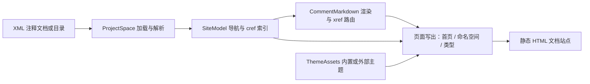

## Product Overview

在 `src\Readership\Readership.vbproj` 中新增一个 API 文档自动生成类库模块（仅对外提供 API，不含可执行入口），把 .NET 程序集编译产生的 XML 注释文档渲染为一套可离线浏览的静态 HTML 文档站点，供开发者查阅参考。生成站点支持自由配置 CSS 主题，默认主题与当前软件项目前端（`dist\wwwroot`）保持一致：暗色技术极简风格、绿色强调色、细线分隔。

## Core Features

- 输入加载：支持扫描一个目录下的全部 `*.xml` 注释文档并合并为一个文档站点；也支持指定单个程序集/XML 文件。
- 页面结构：首页索引 → 每个命名空间一个页面 → 每个类型一个页面；类型内的字段、属性、方法、事件以锚点定位与跳转。
- 内容渲染：`summary`、`remarks`、参数、返回值、示例等注释文本按 Markdown 转换为 HTML；类型页展示成员概览表与成员详细信息（签名、参数表、返回值、示例）。
- 对象链接：解析并渲染 XML 注释中的 `&lt;see cref="..."/&gt;`、`&lt;seealso&gt;` 等交叉引用，生成指向对应类型页或成员锚点的可用超链接；无法解析的目标降级为纯文本。
- 主题可配置：内置默认主题（与现有站点一致的 scibasic 暗色主题），并支持通过参数指定外部主题目录或自定义 CSS；生成时同步发布主题静态资源（CSS/JS/图标）。
- 输出目录必须由调用参数显式指定，不提供默认值。
- 依赖库修复：测试过程中若发现基础代码库的 XML 文档解析模块或 Markdown 转换器存在缺陷，直接修复底层代码。
- 测试：在 `test\test.vbproj` 命令行测试项目中验证生成结果（页面齐全、内部链接可达、Markdown 与对象链接渲染正确）。

## Tech Stack

- 语言/框架：VB.NET（`net10.0`），类库（`OutputType` 保持默认 Library，仅提供 API）。
- 复用依赖（已在 Readership.vbproj 中引用）：`Core.vbproj`（`ProjectSpace` XML 注释加载与解析）、`markdown.NET5.vbproj`（`MarkdownRender` / `MarkdownParser` / `HtmlRender`）。
- 渲染方式：`StringBuilder` 直接生成纯静态 HTML（不引入前端框架）；主题资源以内嵌资源 + 可替换的外部主题目录两种方式提供。
- 测试宿主：`test\test.vbproj`（Exe），需新增对 `src/Readership/Readership.vbproj` 的 `ProjectReference`。

## Implementation Approach

整体流程：读取选项 → 用 `ProjectSpace` 加载输入（文件或目录）→ 构建站点导航模型（slug / 页面清单 / `cref → url` 索引）→ 逐条注释文本经 `MarkdownRender` 转换 → 写出三类页面并发布主题资源。

关键决策与理由：

1. **URL 与导航模型**：命名空间页 `namespaces/{ns}.html`，类型页 `types/{ns}.{type}.html`，成员锚点 `#member-{name}`。构建 `Dictionary(Of String, String)` 的 `cref → url` 索引，交叉引用解析为 O(1)。
2. **`&lt;see cref&gt;` 链接策略**：当前 `TrimAssemblyDoc` / `__trans` 把 `&lt;see cref="X"/&gt;` 改写成内联代码并错误地加上 `@` 前缀，丢失了引用目标。改为输出 Markdown 链接 `[短名](cref:T:Ns.Type)`（保留原始 cref 标识，含 `M:Ns.Type.Method(args)` 的带参数签名），去掉 `@` 前缀；Readership 侧利用 `MarkdownRender` 的 URL router（`HtmlRender.AnchorLink` 与 `Image` 均走 `router`）把 `cref:` 映射为实际页面链接，解析失败则回退为纯文本。选择该方案是因为它只需对 Core 做局部、非侵入式改动，且改动对该预处理器的其它消费者仍是更合理的 Markdown 输出。
3. **Markdown 转换**：对每条注释文本调用 `MarkdownRender.Transform`；对重复出现的注释文本做 memo 缓存，避免重复解析。
4. **主题机制**：内置默认主题 `scibasic`（scibasic.css + 交互 JS + favicon，作为 `EmbeddedResource` 编译进 Readership 程序集）；`Theme` 选项既可为内置主题名，也可为外部主题目录（目录内 `theme.css` 等），输出时复制到站点 `assets/`。
5. **底层缺陷修复**：修复 `ProjectType` 的 `fields`/`events` 初始化与 `EnsureEvent` 误写 `fields` 的问题；修复 `Project.processMember`/`processType` 对嵌套类型（`+`）、泛型类型名（`` `n ``）及重载短名的解析；修复 `MarkdownParser` 在复杂文档（嵌套列表、表格内联、代码围栏、强调分隔符边界、参考式链接）上的解析错误。

性能与可靠性：

- 站点构建为单遍处理；`cref` 解析 O(1)；Markdown 转换通过缓存降低重复开销；页面写出为顺序 IO，站点规模很大时可对页面写出并行化。
- 大 XML（如 `Microsoft.VisualBasic.Runtime.xml`）按整文件 DOM 加载，注意内存峰值，避免重复读取同一文件。
- 复杂度约为 O(注释文本总长度) + O(成员数) + O(页面数)，无明显的 N+1 或重复遍历。

## Implementation Notes

- 复用既有约定：沿用 `ProjectSpace.ImportFromXmlDocFile` / `ImportFromXmlDocFolder` 加载，异常记录沿用 Core 现有 `App.LogException` / `.debug` 写法，不引入新的日志框架。
- 安全性：所有注释文本、成员签名、路径在写入 HTML 前必须转义（复用 `Render.EscapeHtml` 的思路或自建转义函数），防止注释中的 `&lt;`、`&amp;` 破坏页面结构或造成注入。
- 影响面控制：`TrimAssemblyDoc` 是全局预处理器，改动前先用 `[subagent:code-explorer]` 核对其所有调用点（至少包括 `ProjectSpace.CreateDocProject` 与 `APIExtensions.Load`），确认为向前兼容的改进后再修改。
- 输出确定性：命名空间、类型、成员均按名称稳定排序，便于 diff 与结果复现。
- 文件/URL 兼容性：slug 仅保留 `[A-Za-z0-9._-]`，其余字符替换或编码，规避 Windows/Linux 文件名差异。

## Architecture Design

组件职责：`ApiDocGenerator` 负责编排；`SiteModel` 负责页面清单与 `cref` 索引；`CommentMarkdown` 封装 Markdown 渲染与 xref 路由；页面写出器分为首页/命名空间/类型三类；`ThemeAssets` 负责主题解析与资源发布。



## Directory Structure

```
src/Readership/
├── Readership.vbproj                    # [MODIFY] 保持类库；新增 EmbeddedResource（内置主题）、GenerateDocumentationFile
├── ApiDocOptions.vb                     # [NEW] 公共选项模型：Input、Output（必填）、Theme、Title 等；含输入类型校验（文件/目录）
├── ApiDocGenerator.vb                   # [NEW] 公共入口 API：加载输入 → 构建站点模型 → 渲染页面 → 发布主题；返回构建结果（页面数/警告）
├── ApiDocSite.vb                        # [NEW] 站点模型：命名空间/类型/成员清单、slug 生成、cref 规范化与 cref→url 索引、稳定排序
├── CommentMarkdown.vb                   # [NEW] 封装 MarkdownRender：Transform 缓存、cref 链接 router、XML 标签与转义规范化
├── Html/
│   ├── HtmlPage.vb                      # [NEW] HTML 基础设施：转义、页面骨架（topbar/侧边导航/内容/footer）、签名与表格片段
│   ├── IndexPageWriter.vb               # [NEW] 首页索引：统计、搜索框、命名空间与程序集列表
│   ├── NamespacePageWriter.vb           # [NEW] 命名空间页：命名空间注释（Markdown）+ 类型概览表
│   └── TypePageWriter.vb                # [NEW] 类型页：类型摘要/备注、语法签名、成员分组表、成员详情锚点（参数表/返回值/示例）
└── Themes/
    ├── ThemeAssets.vb                   # [NEW] 主题解析（内置名或外部目录）与资源发布到输出 assets/
    ├── scibasic.css                     # [NEW] 默认主题，源自 dist\wwwroot\assets\css\scibasic.css（作为内嵌资源）
    ├── scibasic.js                      # [NEW] 页面交互：侧边栏折叠、搜索过滤、锚点平滑滚动
    └── favicon.png                      # [NEW] 站点图标，复制自 dist\wwwroot\favicon.png

G:/GCModeller/src/runtime/sciBASIC#/Microsoft.VisualBasic.Core/src/ApplicationServices/VBDev/XmlDoc/
├── ProjectType.vb                       # [MODIFY] 修复 New() 未初始化 fields/events；EnsureField/EnsureEvent 惰性初始化；EnsureEvent 误写 fields
├── Project.vb                           # [MODIFY] 修复 processMember/processType 对嵌套类型(+)与泛型类型名(`n)的短名解析
└── Serialization/APIExtensions.vb       # [MODIFY] TrimAssemblyDoc/__trans 将 see/seealso cref 转为保留目标的 Markdown 链接，去掉 @ 前缀

G:/GCModeller/src/runtime/sciBASIC#/mime/text%markdown/
└── MarkdownParser.vb                    # [MODIFY] 修复测试发现的复杂 Markdown 解析缺陷

test/
├── test.vbproj                          # [MODIFY] 新增 ProjectReference 指向 src/Readership/Readership.vbproj
├── Program.vb                           # [MODIFY] 增加命令行参数分派，保留原有 TOTP 自检逻辑
└── ApiDocTest.vb                        # [NEW] 文档生成测试：批量读取 dist/bin 的 XML 生成到临时目录，校验页面存在、内部链接可解析、Markdown/xref 渲染正确
```

## Key Code Structures

```
' 公共配置模型（调用方与测试项目共用）
Public Class ApiDocOptions
    Public Property Input As String                  ' 单个 .xml 文件或包含 *.xml 的目录
    Public Property Output As String                 ' 必填，静态站点输出目录（无默认值）
    Public Property Theme As String = "scibasic"     ' 内置主题名或外部主题目录
    Public Property Title As String = "API Reference"
End Class

' 公共入口：一次性生成静态站点
Public Module ApiDoc
    Public Function Generate(options As ApiDocOptions) As DocBuildResult
End Module
```

## 设计定位

生成物是一套可离线打开的桌面 Web 文档站点，视觉基调完全继承现有项目前端（`dist\wwwroot` 的 scibasic 暗色主题），强调“技术极简、信息密度高、签名可读”。

## 页面骨架（所有页面共用）

- 顶部栏 topbar：左侧品牌（图标 + 站点标题 + 程序集名），中部主导航（首页 / 命名空间 / 类型），右侧返回与主题切换按钮；`position: sticky` + 毛玻璃背景 + 细线底边。
- 左侧导航栏：命名空间与类型的可折叠树，当前节点高亮（绿色竖线 + 高亮文字），支持即时搜索过滤。
- 主内容区：`min(1060px, 92vw)` 居中容器，区块用带编号的 `sec-label` 标题分隔，配细线延伸。
- 页脚 footer：生成时间、来源程序集、主题名、许可链接。

## 首页索引

- 大标题（关键词加绿色下划线）+ 一句站点说明。
- 统计条：命名空间数 / 类型数 / 成员数 / 程序集数，卡片带数字与标签，入场轻微上浮动画。
- 搜索框（带放大镜图标），输入即过滤下方列表。
- 命名空间卡片列表：命名空间全名、摘要首句、类型数量，悬停时边框转为绿色并轻微上浮。

## 命名空间页

- 面包屑 `eyebrow` 区块标识当前位置。
- 命名空间注释（Markdown 渲染，含代码块与表格样式）。
- 类型概览表：类型名（链接到类型页）、类型分类（Class/Module/Interface/Enum）、摘要首句；表头小写间距字距放大，行悬停背景加深。

## 类型页

- 类型标题 + 类型分类徽章 + 所在命名空间面包屑。
- 类型摘要与备注（Markdown 渲染）。
- 语法签名块：等宽字体、深色面板、左侧绿色细边，长签名横向可滚动。
- 成员概览表：字段 / 属性 / 方法 / 事件分组，方法显示重载数量并跳转到对应锚点。
- 成员详情区：每个成员一个 `member-{name}` 锚点，含签名、参数表（参数名等宽字体）、返回值、示例代码块；鼠标悬停高亮整块，被导航定位时短暂描边。

## 交互与响应式

- 侧边栏树折叠、搜索过滤、锚点平滑滚动、外链新窗口打开。
- 窄屏（`<900px`）隐藏侧边栏，改为顶部可展开目录；表格横向滚动；代码块保持等宽可横向滚动。

## Agent Extensions

### SubAgent

- **code-explorer**
- Purpose: 核对 Core 中 `TrimAssemblyDoc` 与 cref 预处理逻辑的全部调用点及影响面，确认改动不会破坏 `ProjectSpace.CreateDocProject` 与 `APIExtensions.Load` 等既有消费者。
- Expected outcome: 输出调用点清单与兼容性结论，作为修改 `APIExtensions.vb` 的前置依据。

### Skill

- **agent-browser**
- Purpose: 打开生成的静态文档站点（首页 / 命名空间页 / 类型页）进行截图与 DOM 检查，核对主题渲染、锚点跳转、内部链接可达性与 Markdown 输出效果。
- Expected outcome: 生成页面截图与链接检查结论，定位视觉或渲染问题并驱动修复闭环。