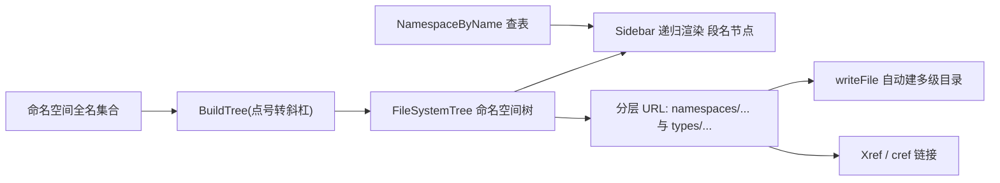

## 产品概述

对 `src\Readership\Readership.vbproj`（代码 API 文档静态站点生成类库）生成的 HTML 文档站点做布局与文件组织优化，解决三处实际使用问题：侧边导航被超长命名空间撑爆、页面整体偏窄显得拥挤、以及所有 HTML 平铺在同一目录导致大项目下单目录文件数爆炸。

## 核心需求

1. **侧边导航改为命名空间树**

- 导航数据改为使用基础代码库的 `FileSystemTree`（`.../ApplicationServices/FileSystem/Fs/FileSystemTree.vb`）构建命名空间树。
- 左侧导航栏以「树」的方式呈现：节点只显示本段名称（如 `Microsoft` → `VisualBasic` → `ApplicationServices`），不再显示完整命名空间名。
- 侧边栏宽度因此可显著收窄，消除长名挤压与整体拥挤感。

2. **页面宽度**

- 页面整体宽度限制改为视口宽度的 **90%**，减少布局拥挤。

3. **按命名空间层次落盘文件**

- 现状：命名空间页与类型页都以完整全名作为文件名，全部平铺在 `namespaces/`、`types/` 两个目录中。
- 目标：依据所构建的命名空间树，把文档按命名空间层级写入多级子目录，避免单目录文件数过多导致文件系统压力。

## 视觉与行为效果

- 侧边栏变成可逐级展开/折叠的命名空间树：默认仅展开当前页面所属命名空间的祖先链并高亮当前项；节点旁保留类型数量角标；当前命名空间下以短名列出其类型。
- 导航不再出现 `Microsoft.VisualBasic.ApplicationServices.Development.XmlDoc.Serialization` 这类超长文本，侧栏列宽可收窄，正文区获得更多横向空间。
- 页面以 90% 视口宽度居中，表格、签名块、参数表不再轻易出现横向滚动或换行挤压。
- 站点文件结构变为按层级分目录，同一目录内文件数量可控；站内链接、`cref` 交叉引用、成员锚点跳转行为保持不变（仅 URL 变深）。

## 技术栈选择

- 语言/框架：沿用现有 `VB.NET`（`net10.0`）类库 `src/Readership/Readership.vbproj`，不新增任何依赖。
- 复用（只读）：`Core.vbproj` 的 `Microsoft.VisualBasic.ApplicationServices.FileSystemTree`（含 `BuildTree`/`GetFile`/`AddFile`/`Parent`/`Name`/`Files`/`data`）。
- 产物渲染：继续用 `StringBuilder` 生成纯静态 HTML；样式为项目自有 CSS（`Themes/scibasic.css` + `Themes/docs.css`），交互为原生 JS（`Themes/docs.js`）。
- 测试宿主：`test/test.vbproj` 的 `apidoc` 子命令。

## 实现方案

整体策略：**先改数据模型（树 + 分层 URL），再改渲染（侧栏/面包屑），最后改样式与交互，并用测试与浏览器截图闭环验证。**

### 1. 命名空间树与分层 URL（`ApiDocSite.vb`）

- 新增站点属性：`NamespaceTree As FileSystemTree`、`NamespaceByName As Dictionary(Of String, DocNamespaceEntry)`（`OrdinalIgnoreCase`）。
- 关键事实：`FilePath.ParseTokens` **只按 `/` 与 `\` 分段**，不按 `.` 分段。因此构建树时必须把命名空间名转换为路径形式：
`FileSystemTree.BuildTree(namespaceNames.Select(Function(n) n.Replace("."c, "/"c)))`。
由此每个节点即一个命名空间段，`node.Name` 就是该段名称。
- 判断「某节点是否对应真实命名空间」不能用 `node.data`（`BuildTree` 只在末段写 `data`，而中间段可能同时是真实命名空间），改为用 `NamespaceByName` 按「祖先段名以 `.` 连接」拼出的全名查表。
- URL 方案（相对站点根，`Slug` 仅保留 `[A-Za-z0-9._-]`）：
- 命名空间页：`namespaces/<seg1>/<seg2>/…/<segN>.html`
- 类型页：`types/<seg1>/<seg2>/…/<segN>/<TypeSlug>.html`
- 全局命名空间（`Name` 为空）：`namespaces/_global.html`、`types/_global/<TypeSlug>.html`
- 每层目录内用 `HashSet(Of String)`（忽略大小写）做文件名去重，冲突时追加 `-2`、`-3`。
- 替换现有 `PageUrl(folder, key, used)`（当前把整条全名当成单一文件名）为：
`NamespaceUrl(name)`、`TypeUrl(namespaceName, typeName)` 两个函数，内部先分段再拼路径。
- 影响面小：`BaseUrl(pageUrl)` 已按 `pageUrl` 中 `/` 的个数生成 `../`，URL 变深后自动正确；`ApiDocGenerator.writeFile` 已按 `/` 转分隔符并自动 `Directory.CreateDirectory` 父目录，天然支持多层目录；`cleanOutput` 删除 `namespaces`/`types` 整目录，无需改动。
- `buildXref()`/`ResolveUrl()`/成员锚点逻辑不变（`t.Url`、`ns.Url` 只是值变深）。

### 2. 侧边栏树形渲染（`Html/HtmlPage.vb`）

- 重写 `Sidebar(pageUrl)`：从 `Site.NamespaceTree` 递归渲染嵌套 `<details>`/`<ul>`。
- 节点显示文本仅 `node.Name`（本段名）；对应真实命名空间时渲染为 `<a href="{base}{ns.Url}">` 并显示类型数量角标，否则渲染为不可点击的分组标签。
- 当前页面所属命名空间（沿用 `ActiveNamespace(pageUrl)`）的祖先链自动 `open` 且高亮；`Site.Types.Count <= 600`（沿用现有阈值语义）时整体展开。
- 在展开的当前命名空间节点下，额外以**短名**列出其类型（保留可用性，且不会出现长全名）。
- 全局命名空间渲染为顶层 `(global)` 节点。
- `BaseUrl`/`Page`/`Markdown`/`ActiveNamespace` 保持不变。

### 3. 样式与交互（`Themes/docs.css`、`Themes/docs.js`）

- `docs.css`：
- `.doc-shell { width: 90%; max-width: none; margin: 0 auto; padding: 0; grid-template-columns: 250px minmax(0, 1fr); }`（侧栏列宽由 300px 收窄到 250px）。
- 新增树形节点样式：`.doc-children`（子级 `<ul>` 缩进 + 左侧引导线）、`.doc-node`（无页面节点的不可点击标签）、复用/微调 `.doc-ns`、`summary::before` 三角、`.count`、`.doc-types`。
- 保持响应式：`@media (max-width: 1000px)` 下侧栏改为静态块。
- `docs.js`：把平铺过滤改为**递归过滤**——输入关键字时，节点名命中、或其后代节点/类型命中，则显示该节点并自动展开其祖先链，隐藏不匹配的兄弟节点；清空输入时恢复默认展开状态；保留 index 页 `#index-filter` 与「当前项滚动可见」逻辑。

### 4. 面包屑分级（`Html/NamespacePageWriter.vb`、`Html/TypePageWriter.vb`）

- 面包屑按命名空间段逐级链接：`Overview / Microsoft / VisualBasic / … / 当前节点`，每级指向对应命名空间页（无页面的中间段渲染为纯文本）。这与树形导航形成一致的层级体验。

### 性能与可靠性

- 构建为单遍：`BuildTree` 复杂度 O(命名空间数 × 段数)；URL 生成 O(命名空间数 + 类型数)；`NamespaceByName` 查表 O(1)，递归渲染每个节点仅一次。
- 侧边栏 HTML 体积由「每页平铺全部命名空间全名 + 类型」降为「按层级的段名树」，单页体积显著下降（更利于近 2000 页规模站点的总产物体积与生成耗时）。
- 深度注意：更深的目录层级会加长绝对路径，需要留意 Windows `MAX_PATH`（260）限制；段名本身很短，实测 Core 程序集最深命名空间路径长度仍在安全范围，测试中会增加「最深路径长度」统计以便监控。

## 实现要点（执行注意事项）

- `FileSystemTree.BuildTree` 的路径必须用 `/` 连接，切勿直接传点号命名空间（否则整条名字会变成单个节点）。
- `FileSystemTree.GetFile` 依赖 `Files` 字典非空；根节点与 `AddFile` 创建的子节点均已初始化 `Files`，递归时直接使用 `node.Files` 即可。
- 判定「真实命名空间」一律走 `NamespaceByName` 全名查表，不要依赖 `node.data`。
- 所有写入 HTML 的文本继续用 `DocHtml.Escape/Attr` 转义；URL 拼接沿用站点相对路径 + `BaseUrl` 前缀。
- 保持向后兼容：`cref` 索引键（`T:`/`M:`/`P:`/`F:`/`E:`/`N:` 及无前缀形式）与成员锚点格式不变，避免破坏已有交叉引用语义。
- 不改动 Core 的 `FileSystemTree`（仅复用）；本次无需修改 `ApiDocGenerator.vb` 的写出逻辑。

## 架构设计



## 目录结构

```
src/Readership/
├── ApiDocSite.vb                      # [MODIFY] 新增 NamespaceTree/NamespaceByName；把 PageUrl 拆为 NamespaceUrl/TypeUrl，按命名空间段分层生成 URL（namespaces/seg1/…/segN.html、types/seg1/…/segN/Type.html），全局命名空间用 _global；每层目录内 HashSet 去重
├── Html/
│   ├── HtmlPage.vb                    # [MODIFY] 重写 Sidebar：基于 NamespaceTree 递归渲染嵌套 details/ul，节点只显示本段 name，真实命名空间节点为链接+类型计数角标，祖先链自动展开并高亮，当前命名空间下以短名列出类型，全局命名空间为 (global) 顶层节点；其余方法不变
│   ├── NamespacePageWriter.vb         # [MODIFY] 面包屑按命名空间段逐级链接；类型表链接沿用 {base}{t.Url}
│   └── TypePageWriter.vb              # [MODIFY] 面包屑按命名空间段逐级链接，随后指向类型自身
└── Themes/
    ├── docs.css                       # [MODIFY] .doc-shell 宽度改 90%（去 max-width、padding 归零）、侧栏列宽收窄为 250px；新增 .doc-children/.doc-node 等树形节点样式，微调 .doc-ns/summary 以适应嵌套层级；保持移动端断点
    └── docs.js                        # [MODIFY] 侧栏过滤改为递归匹配（节点名/后代节点/类型），命中自动展开祖先并隐藏不匹配分支，清空恢复；保留 #index-filter 与当前项滚动可见

test/
├── ApiDocTest.vb                      # [MODIFY] 增加目录分布统计报告：HTML 文件总数、单目录最大文件数、最深目录层级/最长相对路径，用于验证需求 3；保持既有链接与锚点校验 0 problems

README.md                              # [MODIFY] 更新第 11 节：说明侧栏为命名空间树、页面宽度 90%、文件按命名空间层级分目录
```

## 关键代码结构（可选）

```
' 分层 URL 约定（site relative）
'   命名空间 A.B.C  ->  namespaces/A/B/C.html
'   类型  A.B.C.Foo ->  types/A/B/C/Foo.html
'   全局命名空间    ->  namespaces/_global.html / types/_global/Foo.html

' ApiDocSite
Public ReadOnly Property NamespaceTree As FileSystemTree
Public ReadOnly Property NamespaceByName As Dictionary(Of String, DocNamespaceEntry)

Private Shared Function NamespaceUrl(name As String) As String
Private Shared Function TypeUrl(namespaceName As String, typeName As String, used As HashSet(Of String)) As String

' HtmlPage.DocSiteContext
Public Function Sidebar(pageUrl As String) As String            ' 递归渲染命名空间树
Private Function RenderNamespaceNode(node As FileSystemTree, path As String, base As String, pageUrl As String) As String
```

## 设计定位

生成物仍是「可离线打开的暗色技术极简 API 文档站点」，视觉基调与现有 `dist/wwwroot` 前端完全一致（沿用 `scibasic.css` 的颜色/字体 token）。本次只改造**布局骨架**，不改配色与字体体系。

## 布局调整

- 页面外壳 `.doc-shell` 宽度改为视口 **90%** 居中（取消 1360px 上限），左右留白由内边距改为百分比宽度控制，使正文区更宽、信息不再拥挤。
- 侧栏列宽 300px → 250px，配合树形节点（只显示本段名）彻底消除超长命名空间导致的横向挤压。
- 正文区 `.doc-wrap` 自适应剩余宽度；表格、签名块、参数表获得更充裕的横向空间，减少换行与横向滚动。

## 侧边栏（命名空间树）

- 结构：可逐级展开/折叠的嵌套树。每个节点一行，左侧为三角展开标记（`▸` 展开时旋转 90 度），中间为节点名（仅本段名，如 `VisualBasic`），右侧为类型数量角标（小号、弱化色）。
- 层级的视觉层级：子级整体缩进并使用 1px 弱分隔线作引导线；树节点为链接时悬停变绿、当前项以绿色左边线高亮并保持展开。
- 仅当前页面所属命名空间的祖先链默认展开，避免一进入页面就被大量节点淹没；站点点规模较小时（类型数不超过阈值）默认整体展开。
- 当前命名空间节点之下，以更小字号、纯短名列出该命名空间的类型，作为一级快捷入口。
- 顶部保留筛选输入框：输入即递归过滤节点（匹配本节点、后代节点或类型），并自动展开命中分支。

## 面包屑

命名空间页与类型页的顶部面包屑改为逐级可点击的路径（`Overview / Microsoft / VisualBasic / …`），与左侧树形成一致的层级认知；无独立页面的中间段渲染为不可点击的弱化文本。

## 交互与响应式

- 树节点展开/折叠、筛选过滤、锚点平滑滚动保持不变；当前项进入视口时自动滚动到侧栏可视区域。
- 窄屏（≤1000px）侧栏退化为顶部静态可折叠区域，正文占满 90% 宽度；表格与代码块保持可横向滚动。

## Agent Extensions

### SubAgent

- **code-explorer**
- Purpose: 在改动 `ApiDocSite.vb`/`HtmlPage.vb` 前，核对 `ns.Url`/`t.Url`/`Xref` 全部使用点（IndexPageWriter / NamespacePageWriter / TypePageWriter / ApiDocGenerator / docs.js），并确认 `FileSystemTree` 在 Core 中的可见性与可用成员，避免遗漏 URL 变深后的回归点。
- Expected outcome: 输出「URL 使用点清单 + FileSystemTree 可用 API 结论」，作为分层 URL 改造的兼容性依据。

### Skill

- **agent-browser**
- Purpose: 打开重构后生成的文档站点（首页 / 命名空间页 / 类型页），检查树形侧栏的展开/高亮/筛选、90% 宽度下的布局观感、面包屑分级与锚点跳转。
- Expected outcome: 输出页面截图与交互检查结论（侧栏不再出现超长全名、无横向挤压、层级正确），据此完成最后一轮视觉修复。