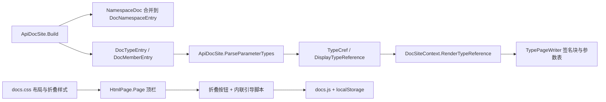

## 产品概述

继续优化 Readership 生成的静态 API 文档站点的页面布局与内容表现，解决侧栏高度受限/内部滚动、侧栏与正文过于贴近、侧栏无法折叠记忆、方法参数类型无法跳转、以及 NamespaceDoc 魔法类型被错误生成为独立页面这五类问题。整体视觉仍保持现有 scibasic 暗色技术极简风格。

## 核心功能

### 1. 左侧导航栏解除高度限制

左侧导航栏不再设置最大高度、不再出现内部滚动条，随命名空间树内容自然增高，页面只有一个整体滚动条。

### 2. 侧栏与正文之间留出间隔

左侧导航栏与右侧文档内容之间增加明显的水平间隔（当前两者直接相邻显得拥挤），侧栏保留一条细线分隔，正文区不再紧贴侧栏。

### 3. 侧栏可折叠并记忆状态

顶部提供折叠/展开按钮，点击即可收起或显示左侧导航栏；折叠状态写入浏览器本地存储，用户下次打开任意页面时保持上次的折叠/展开状态，且页面初次渲染不出现状态闪烁。

### 4. 方法参数类型解析与跳转链接

把成员签名中的参数类型解析出来：签名块中的参数类型渲染为可点击的链接，参数表新增“类型”列同样给出跳转入口；点击后直接跳转到该类型的定义页面。例如 `op_Inequality(Microsoft.VisualBasic.ComponentModel.DataStructures.Set, Microsoft.VisualBasic.ComponentModel.DataStructures.Set)` 中的 `Set` 类型可被解析并链到其类型页。

### 5. NamespaceDoc 魔法类型特殊处理

`NamespaceDoc` 是用于承载其所在命名空间文档的魔法类型：生成文档时只提取该类型的注释内容（摘要与备注）并合并到其所属命名空间上，不再为 `NamespaceDoc` 生成任何独立的 HTML 页面，也不再计入类型数量与交叉引用索引。

## 视觉与行为效果

- 侧栏无独立滚动条，长树形导航随页面一起滚动；正文获得稳定宽度。
- 侧栏与正文之间有 32px 左右留白，层次清晰不再拥挤。
- 顶栏出现一个与“返回顶部”同款式的圆形折叠按钮，折叠后正文占据整个内容区宽度；状态被本地记忆。
- 类型页成员签名中的参数类型呈现为带下划线的链接样式（站内类型为绿色悬停高亮，站外类型降级为等宽文本），参数表呈现“名称 / 类型 / 说明”三列。
- 命名空间页展示从 `NamespaceDoc` 提取的命名空间说明；站点中不再存在 `NamespaceDoc` 的独立页面。

## 技术栈

- 语言/框架：沿用 VB.NET（`net10.0`）类库 `src/Readership/Readership.vbproj`，不新增任何依赖。
- 产物：`StringBuilder` 生成纯静态 HTML；样式为项目自有 CSS（`Themes/scibasic.css` 基础 token + `Themes/docs.css` 文档布局）；交互为原生 JS（`Themes/docs.js`）。
- 复用（只读）：`Core.vbproj` 的 `ProjectSpace` / `ProjectType` / `ProjectMember` / `APIExtensions.NamespaceDoc`。
- 测试宿主：`test/test.vbproj` 的 `apidoc` 子命令。

## 实现方案

### 1. 侧栏解除高度限制（docs.css）

`.doc-side` 去掉 `position: sticky`、`top`、`max-height: calc(100vh - 79px)`、`overflow-y: auto`，改为 `position: static; max-height: none; overflow: visible`（保留右上内边距与右侧 1px 分隔线）。`.doc-side-head` 去掉 `position: sticky; top: 0; z-index`。移动端断点中的 `max-height: 260px` 一并移除。侧栏改为正常文档流后，`docs.js` 中依赖侧栏内部滚动的「把当前节点滚到侧栏可视区」逻辑失效，直接移除，避免自动滚动窗口带动正文跳动，仅保留高亮与祖先链展开。

### 2. 区域间隔（docs.css）

`.doc-shell` 增加 `column-gap: 32px`（侧栏与正文分离），`.doc-side` 保留 `border-right: 1px solid var(--hairline2)` 与右侧内边距，正文区无需额外左内边距。

### 3. 侧栏折叠 + localStorage 记忆

- `HtmlPage.Page()`：把顶栏右侧两个按钮包进 `<div class="topbar-tools">`，新增 `<button id="doc-side-toggle" class="home-btn doc-toggle" type="button" aria-controls="doc-tree" aria-expanded="true">`（与 `.home-btn` 同款式，样式上重置 button 默认背景/内边距/光标）；`<head>` 末尾注入一段最小内联引导脚本，在解析早期读取 `localStorage['readership.sidebar'] === 'collapsed'` 并给 `<html>` 加 `side-collapsed` 类，规避首屏闪烁。
- `docs.css`：`html.side-collapsed .doc-shell { grid-template-columns: minmax(0, 1fr) }`、`html.side-collapsed .doc-side { display: none }`，另加 `.topbar-tools` 与 `.doc-toggle` 规则。
- `docs.js`：绑定点击切换 `html.side-collapsed`，写回 `localStorage`（`collapsed` / `expanded`，用 try/catch 兼容禁用场景），同步按钮 `aria-expanded` 与 `title`。主题资源以 `EmbeddedResource` 内嵌，修改 `Themes/*` 后必须重新编译 Readership 才生效。

### 4. 参数类型解析与链接

在 `ApiDocSite` 增加三个纯函数（无副作用、可单测）：

- `ParseParameterTypes(declare) As String()`：取第一个 `(` 与匹配的最后一个 `)` 之间的内容，按顶层逗号切分（深度计数 `{}`/`()`/`[]`）；无括号或空参数返回空数组。
- `TypeCref(typeReference) As String`：去掉尾部 `[]`/`*`/`@`；若形如 `Outer{A,B}` 则按首个 `{...}` 组内顶层参数个数得到 arity，拼成 `Outer\`n`；返回 `"T:" & fullName`，供 `ResolveUrl` 复用。
- `DisplayTypeReference(typeReference) As String`：递归生成 VB 风格显示名（`Dictionary{System.String,System.Object}` → `Dictionary(Of String, Object)`；`System.String[]` → `String()`）。
在 `DocSiteContext` 增加：
- `RenderTypeReference(typeReference, pageUrl)`：命中 `Site.ResolveUrl(TypeCref(...))` 时输出 `<a class="cref" href="{base}{url}" title="{原始类型}">{显示名}</a>`，否则输出 `<code class="sig-type" title="...">{显示名}</code>`（站外类型降级）。
- `MemberSignature(typeEntry, member, pageUrl)`：把 `member.Signature(typeEntry)` 的 `Name(Type1,Type2)` 渲染为 `Name(<链接>, <链接>)`；无法解析参数时回退为整体转义文本。
`TypePageWriter`：签名块由转义文本改为 `ctx.MemberSignature(...)`；`paramTable` 增加可选 `typeRefs As String()` 参数，`Parameters` 表输出 `Name / Type / Description` 三列（`Type` 列用 `RenderTypeReference`，按索引与 `ProjectMember.Params` 对齐），`Type Parameters` 表保持两列。`docs.css` 调整 `.param-table` 列宽并为 `.sig` 内的 `a.cref`/`code.sig-type` 增加样式。
说明：XML 注释文档的 doc id 不含返回类型，因此本次仅对参数类型建立链接，不臆造返回类型信息。

### 5. NamespaceDoc 特殊处理

`ApiDocSite.Build` 遍历 `ns.Types` 时识别 `t.Name = APIExtensions.NamespaceDoc`：不创建 `DocTypeEntry`（从而不生成页面、不进入 `Types`/`xref`/类型计数/侧栏角标），改为把其 `Summary` 与 `Remarks` 去重合并进所属 `DocNamespaceEntry.Summary`（空行分隔）。为此给 `DocNamespaceEntry` 增加内部收集与收尾方法（`AddNamespaceDoc` / `SealNamespaceDoc`），`Build` 先创建条目、循环中收集、循环结束后一次性写入 `Summary`；原 `namespaceSummary(ns)` 被取代并删除。仅含 `NamespaceDoc` 的命名空间仍会生成命名空间页（承载命名空间文档），角标为 0 不显示。`<see cref="T:...NamespaceDoc"/>` 因无页面而降级为等宽文本，属可接受行为。

## 性能与可靠性

- 参数类型解析为 O(签名长度)；每个成员一次解析，`ResolveUrl` 为字典查表 O(1)；`DisplayTypeReference` 递归深度受泛型嵌套层数限制，实际极浅。
- NamespaceDoc 过滤使 `Types` 总量略减，页面数量与生成耗时同步下降。
- 折叠状态仅读写一次 `localStorage`；筛选与折叠互不影响（折叠仅隐藏侧栏）。
- 输出确定性保持：命名空间、类型、成员仍按名称稳定排序，`cref` 索引键与成员锚点格式不变（向后兼容既有交叉引用语义）。

## 实现要点（执行注意事项）

- 所有写入 HTML 的文本继续用 `DocHtml.Escape` / `DocHtml.Attr` 转义；类型名可能含 `{`/`}`/`<`/`>`（泛型）与 `[]`，务必只做显示转义，链接 URL 用 `Attr`。
- 参数类型与 `<param>` 节点按索引对齐，数量不一致时只渲染存在的索引，不抛异常。
- 顶栏新增元素后保持 3 个子元素（brand / nav / tools），避免破坏 `justify-content: space-between` 布局。
- 主题 css/js 为内嵌资源，改动后必须重新编译 `Readership.vbproj`；测试用的 `dist/docs*` 已被 `.gitignore` 忽略。
- 不修改 Core 的 `FileSystemTree` 与 `APIExtensions`（仅消费其 `NamespaceDoc` 常量）。

## 架构设计



## 目录结构

```
src/Readership/
├── ApiDocSite.vb                  # [MODIFY] 新增 ParseParameterTypes/TypeCref/DisplayTypeReference/ShortTypeName 纯函数；Build 中识别 NamespaceDoc 不再生成类型页、把 Summary+Remarks 合并到命名空间（新增 DocNamespaceEntry.AddNamespaceDoc/SealNamespaceDoc 与收尾写入），删除 namespaceSummary
├── Html/
│   ├── HtmlPage.vb                # [MODIFY] Page()：<head> 注入 localStorage 引导脚本，顶栏右侧改为 topbar-tools 容器并新增 #doc-side-toggle 折叠按钮；新增 RenderTypeReference 与 MemberSignature 两个渲染方法
│   └── TypePageWriter.vb          # [MODIFY] memberBlock 签名块改用 ctx.MemberSignature；paramTable 支持可选 typeRefs 三列输出（Parameters 表带 Type 列，Type Parameters 保持两列）
└── Themes/
    ├── docs.css                   # [MODIFY] .doc-side 解除 sticky/max-height/overflow（移动端同步）；.doc-side-head 去 sticky；.doc-shell 增加 column-gap: 32px；新增 html.side-collapsed 折叠规则、.topbar-tools、.doc-toggle、.sig-type 与 .param-table 三列列宽
    └── docs.js                    # [MODIFY] 新增侧栏折叠切换与 localStorage 记忆（含 aria/title 同步）；移除失效的侧栏内部滚动定位逻辑；保留递归筛选、index 过滤与锚点平滑滚动

test/
└── ApiDocTest.vb                  # [MODIFY] 增加回归断言友好输出：统计 NamespaceDoc 页面数为 0、类型页中的参数类型链接数量，并在 validate 中校验新增链接可达（保持 problems=0）

README.md                          # [MODIFY] 第 11 节补充：侧栏无高度限制且可折叠（localStorage 记忆）、侧栏与正文间隔、参数类型链接、NamespaceDoc 合并到命名空间且不生成页面
```

## 设计定位

在既有 scibasic 暗色技术极简风格上做布局骨架优化，不改变配色与字体体系；重点是让导航可伸缩、正文更宽、内容层次更清晰。

## 布局调整

- 页面外壳 `.doc-shell` 保持 `width: 90%` 居中，网格列由 `250px + 1fr` 组成并新增 `column-gap: 32px`，侧栏与正文之间形成明确留白。
- 左侧导航栏改为正常文档流：无最大高度、无内部滚动条，随命名空间树自然增高；仅保留右侧 1px 细线分隔作为区域边界。
- 顶栏右侧收敛为「工具区」容器：折叠按钮 + 返回顶部按钮并排，尺寸与圆形边框样式统一。

## 侧边栏

- 树形导航：节点只显示本段名称，展开标记随展开状态旋转 90 度，右侧为子树类型数量角标（弱化小号字、等宽数字）。
- 当前命名空间祖先链默认展开并高亮（绿色左边线），当前命名空间下方以短名列出其类型。
- 折叠后整个侧栏隐藏，正文获得全部内容宽度；展开/折叠状态写入浏览器本地存储并在下次访问时恢复，首屏不闪烁。

## 类型页成员区

- 签名块：等宽字体、深色面板、左侧绿色细边；其中的参数类型渲染为可点击链接（站内类型为下划线链接样式、悬停转绿；站外类型为等宽弱化文本），长签名可横向滚动。
- 参数表：`名称 / 类型 / 说明` 三列，名称与类型均为等宽字体，类型列提供跳转入口；表头小写放大字距，行悬停加深背景。
- 类型页不再出现 `NamespaceDoc` 相关条目；命名空间页的说明文字来自 `NamespaceDoc` 提取内容。

## 交互与响应式

- 折叠切换为无刷新即时生效并持久记忆；筛选、展开折叠、锚点平滑滚动保持一致体验。
- 窄屏（不超过 1000px）下侧栏降级为顶部静态块，正文占满宽度，表格与代码块保持可横向滚动。

## Agent Extensions

### Skill

- **agent-browser**
- Purpose: 打开重构后生成的静态文档站点，验证侧栏无内部滚动条且与正文留有间隔、折叠按钮与 localStorage 记忆生效、参数类型链接可点击跳转、NamespaceDoc 不再生成页面。
- Expected outcome: 输出首页/类型页/命名空间页截图与交互检查结论（折叠前后布局、刷新后状态保持、参数类型链接可达、页面数量变化），据此完成最后一轮视觉与行为修复。

### SubAgent

- **code-explorer**
- Purpose: 在改动前核对 `ns.Url`/`t.Url`/`Xref`/`MemberCount`/`Types` 计数等全部使用点，确认 NamespaceDoc 不再进入 `Types` 后受影响的统计与链接不会回归；同时核对 `ProjectMember.DeclareText` 参数列表与 `Params` 的索引对应关系。
- Expected outcome: 输出受影响调用点清单与兼容性结论，作为 `ApiDocSite.Build` 与 `TypePageWriter` 改造的前置依据。