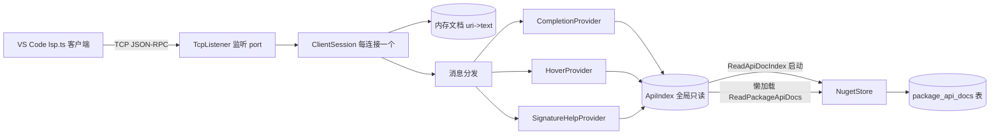

## 用户需求

在 `src/LSP/languageserver/languageserver.vbproj` 项目中，使用 VB.NET 从零搭建一个可被 VS Code 连接的远程 Language Server，依据 `src/LSP/jsonrpc.md` 的 TCP 传输规范实现，为在 VS Code 中编写 VB 脚本的用户提供智能提示能力。

## 产品概述

一个基于 TCP 的 LSP 服务器：启动时从当前 nuget 文档数据库（由 `src/Nuget/Nuget.vbproj` 的 `NugetStore` 管理）全局加载所有已发布包的 API 注释文档，构建只读内存索引；通过 `127.0.0.1:<port>` 与 VS Code 的 `lsp.ts` 客户端（语言 `vbnet`）建立 JSON-RPC 会话，按 LSP 规范响应请求。

## 核心功能

- **传输层**：严格遵循 `jsonrpc.md`——逐字节读取 `Content-Length` 头、按长度精准读取 UTF-8 Body、回写带 `Content-Length` 头的消息；支持多客户端并发（每个连接一个会话）。
- **补全 Completion**：输入 `.` 触发成员（方法/属性/字段/事件）补全；在 `Imports` 行或类型限定符场景触发命名空间/类型名补全；结果带类型化图标与文档摘要。
- **悬停 Hover**：光标位于类型名或 `Type.Member` 上时，显示其签名、摘要与注释文档。
- **签名帮助 SignatureHelp**：输入 `(` 时显示方法重载列表，并按逗号数高亮当前参数。
- **范围与约束**：全局加载全部包（不做按脚本区分）；不做语法纠错、不做编译；数据目录通过 `--data <path>` 指定，`--port` 默认 8080，路径缺失时友好报错退出。

## 技术栈

- 语言/运行时：VB.NET，TargetFramework `net10.0`（与现有项目一致）。
- 传输：仅用 BCL——`System.Net.Sockets.TcpListener/NetworkStream`、`System.Text.Encoding.UTF8`、`System.Text.Json`（JsonNode/JsonObject）。
- 数据：复用 `NugetStore`（`src/Nuget/NugetStore.vb`）与 `ApiDocType/ApiDocMember`（`src/Readership/ApiDocDocument.vb`，经 Nuget 传递引用可直接使用）。
- 项目：`languageserver.vbproj`（OutputType=Exe）已引用 `Nuget.vbproj`，计划显式补充 `Readership.vbproj` 引用以便直接使用 ApiDoc 模型。

## 实现方案

**总体策略**：单进程 TCP 服务器。启动时解析 CLI（`--data`、`--port`）→ 用 `NugetStore` 打开数据库 → 调 `ReadApiDocIndex()` 构建全局只读 `ApiIndex`（命名空间集合 + `fullName→TypeEntry`，同名多版本取 `VersionKey` 最新）→ 启动 `TcpListener` 接受连接，每个连接由一个 `ClientSession` 在独立 Task 中按 jsonrpc.md 的帧规则循环读写并分发消息。

**关键技术决策**：

1. **JSON-RPC 用 JsonNode 透传 `id`**：LSP 的 `id` 可为数字或字符串，使用 `JsonNode("id")` 原样回写，避免类型错配导致 VS Code 认为请求超时。
2. **全局只读索引 + 懒加载成员缓存**：索引仅含标量列（不存 payload），成员（可能很大）按 `(packageId,version)` 用 `ConcurrentDictionary` 懒加载并反序列化 `ApiDocType.payload` 后缓存，避免启动期一次性反序列化全部文档造成的内存与耗时峰值；索引构建后不再变更，多线程读取安全。
3. **无编译器的文本启发式解析**：不引入 Roslyn/编译器。用轻量文本规则判断上下文：`Imports` 行 → 补命名空间/类型；包含 `.` 的限定符 → 拆出容器 `Q`，若 `Q` 命中已知类型全名则补其成员，否则按前缀补命名空间/嵌套类型；方法调用 `(` 内按逗号数定 `activeParameter`。这是“不编译”约束下最务实且可维护的方案。
4. **能力声明**：`textDocumentSync=1`（全量同步，客户端发整文，服务端无需增量合并）、`hoverProvider=true`、`completionProvider.triggerCharacters=["."," "]`、`signatureHelpProvider.triggerCharacters=["("]`。

**性能与可靠性**：

- 索引一次加载；成员懒加载并缓存，补全/悬停/签名复用同一缓存，避免重复反序列化与数据库随机读。
- 补全结果按前缀过滤并设上限（如 200 条），防止巨型 payload 阻塞网络流。
- `NugetStore` 内部已 `SyncLock` 串行化，并发读安全；`ApiIndex` 只读共享；`ClientSession` 文档表仅本连接线程访问，消息按流顺序单线程处理，天然无竞态。
- UTF-8 字节长度必须严格等于 `Content-Length`，中文字符按字节计数，沿用 jsonrpc.md 的编码约定。

## 架构设计



## 目录结构与文件清单

```
src/LSP/languageserver/
├── languageserver.vbproj   # [MODIFY] 保持 OutputType=Exe/net10.0；显式新增 Readership.vbproj 引用以直接使用 ApiDoc 模型
├── Program.vb              # [MODIFY] 入口：解析 --data/--port；打开 NugetStore；构建 ApiIndex；启动 TcpListener；优雅退出
├── JsonRpc.vb             # [NEW] 传输与协议：SendMessageAsync(帧封装)、读取 Header/Body、解析信封、构造 response/notification（JsonNode 透传 id）
├── ApiIndex.vb            # [NEW] 全局只读索引：命名空间集合、fullName→TypeEntry（取最新版本）、按前缀匹配类型/命名空间、GetMembers 懒加载并缓存 ApiDocMember
├── ClientSession.vb       # [NEW] 每连接会话：NetworkStream 循环、消息分发、文档表(didOpen/didChange/didClose)、initialize/initialized/shutdown/exit 处理
├── ScriptAnalyzer.vb      # [NEW] 文本启发式：取光标词、拆分限定符容器、识别 Imports 行、统计调用括号内逗号数、行/字符定位
├── CompletionProvider.vb  # [NEW] 补全逻辑：命名空间/类型/成员补全，带 kind 与 doc 摘要，结果上限
├── HoverProvider.vb       # [NEW] 悬停逻辑：类型/成员摘要与签名（MarkupContent markdown）
└── SignatureHelpProvider.vb # [NEW] 签名帮助：按成员名聚合重载、构造 signatures 与 activeParameter
```

## 关键代码结构

```
' ApiIndex.vb —— 内存索引核心模型与查询入口
Public Class TypeEntry
    Public Property packageId As String
    Public Property version As String
    Public Property namespaceName As String
    Public Property summary As String
    Public Property memberCountHint As Integer
End Class

Public Class ApiIndex
    ' 启动时由 ReadApiDocIndex() 填充，之后只读
    Public Function MatchNamespaces(prefix As String) As IEnumerable(Of String)
    Public Function MatchTypes(prefix As String) As IEnumerable(Of TypeEntry)
    Public Function GetType(fullName As String) As TypeEntry
    ' 懒加载：按 (packageId,version) 调 ReadPackageApiDocs 并反序列化 payload，结果 ConcurrentDictionary 缓存
    Public Function GetMembers(fullName As String) As List(Of ApiDocMember)
End Class
```

## 实现注意事项

- **复用既有模式**：反序列化 `ApiDocType` 复用 `src/Nuget/ApiDocPages.vb` 的 `JsonSerializer.Deserialize(Of ApiDocType)(payload, JsonOptions)` 且 `JsonOptions.PropertyNameCaseInsensitive=True`；版本排序复用 `NugetStore.VersionKey`。
- **数据目录定位**：`--data` 指向含 `nuget` 库的目录；若传入路径下无库文件，尝试其 `db/nuget` 子目录（参照 README `{data}/db/nuget` 布局），仍失败则打印友好提示并退出。
- **日志**：仅用 `Console.WriteLine` 输出连接/请求方法名/错误，避免打印完整 payload；异常捕获后断开该客户端而不影响其他连接。
- **向后兼容**：不改变 `NugetStore`/`ApiDoc*` 任何现有代码与 jsonrpc.md 规范；`lsp.ts` 客户端无需改动。
- **消息边界**：严格逐字节读 Header，绝不对 `NetworkStream` 使用 `StreamReader`，否则预读破坏帧（jsonrpc.md 明确警告）。