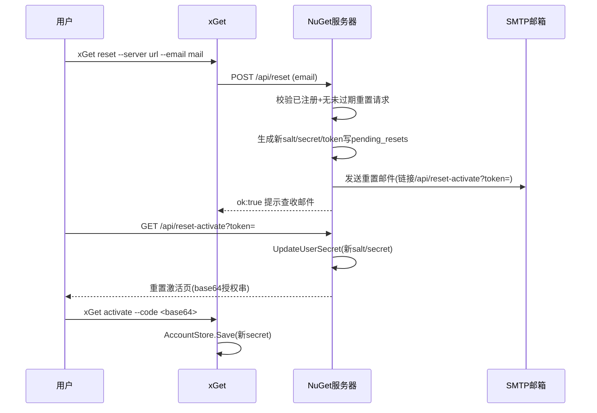

## 产品概述

修复 NuGet 服务器邮箱验证死锁问题：用户点击邮件验证链接后若未及时复制 base64 授权码，账号将永远无法完成激活。本方案通过"链接可重放 + 用户自助密钥重置”双重机制彻底解除死锁，并修正误导性指引。

## 核心功能

- **验证链接 30 分钟内可重放**：验证成功后 pending 记录保留至过期，同一链接在有效期内重复打开均幂等渲染成功页（含 base64 授权串），用户未复制时可直接重新打开邮箱中的链接自救；仅在过期后才显示失败页。
- **用户自助密钥重置**：新增 `xGet reset --server <url> --email <email>` 命令，服务器向该邮箱发送重置链接（30 分钟有效），用户点击后进入重置激活页，复制新的 base64 授权串，通过 `xGet activate` 完成重新激活（旧密钥立即失效）；解锁存量死锁账号（如 xieguigang@innovation.ac.cn）。
- **防邮件轰炸**：同邮箱存在未过期的重置请求时拒绝重复发送。
- **指引修正**：`register` 对已注册邮箱的提示改为引导使用 `xGet reset`，不再误导用户重复注册。
- **模板文案更新**：verify-failed.html 中"can be used only once"文案与一次性语义不再匹配，同步更新。

## 边界与安全

- 重置请求仅对已注册邮箱生效；重置记录存在未过期请求时拒绝重复发送（防轰炸）。
- 重置激活点击后 `UpdateUserSecret` 原子替换旧 salt/secret，旧密钥立即失效。
- base64 授权串格式与验证成功页完全一致（JSON{email, server, secret} → base64），`xGet activate` 无需修改。

## 技术栈

- 后端：VB.NET net10.0（Nuget 模块），JSql `SqlEngine` 存储（手动 esc + SyncLock 串行化、CREATE TABLE IF NOT EXISTS 幂等建表、无 ALTER TABLE）
- 前端 CLI：xGet（原生 VB HTTP 客户端，复用 `NugetApiClient`/`AccountStore`）
- 模板：复用 `DocTemplate.Render` 的 `{{placeholder}}` 机制与现有 verify-* 模板风格

## 实现方案

### 1. 验证链接可重放（Service.VerifyEmail）

- 成功路径**删除** `store.DeletePendingRegistration(pending.id)` 调用，pending 保留至自然过期（`DeleteExpiredRegistrations` 定期清理）。
- 幂等语义：pending 存在且未过期 → 始终走成功分支（账号不存在则创建，已存在则跳过），重复渲染成功页；pending 不存在或已过期 → 失败页（失败原因文案相应更新）。
- 原"already used"失败场景自然消失，失败页仅剩 token 无效/过期两类。

### 2. 自助密钥重置（新表 + 新端点 + 新命令）



- **NugetStore**：新表 `pending_resets`（id/email/token/salt/secret/created/expires，与 pending_registrations 结构一致）；方法 `CreatePendingReset`/`GetPendingReset(token)`/`DeletePendingReset(id)`/`DeleteExpiredResets()`/`HasPendingReset(email)`（防轰炸）。
- **Service**：
- `POST /api/reset`：校验已注册（未注册返回明确错误）→ `HasPendingReset` 防轰炸 → 生成新 salt/secret/token 写入 pending_resets → 发送重置邮件（模板 `reset-email.html`）→ 发送失败清理孤儿记录（沿用验证流程的加固模式）；
- `GET /api/reset-activate?token=`：pending 存在且未过期 → `UpdateUserSecret(email, salt, secret)`（幂等：重复打开时 secret 相同，替换无副作用）→ 构造 base64 授权串 → 复用 `RenderVerifySuccess` 渲染激活页；token 无效/过期 → `RenderVerifyFailed`。
- **MailService**：新增 `RenderResetEmail`（模板 `dist/template/reset-email.html` + 内置 fallback，结构与 verify-email.html 一致，说明这是密钥重置而非新注册）。
- **xGet**：新增 `reset` 命令（POST /api/reset，成功后打印三步指引）；`register` 的 "already registered" next steps 改为引导 `xGet reset`；服务端 RegisterUser 的 already-registered message 同步补充 reset 指引。

### 3. 文案与模板同步

- `verify-failed.html` 与 `fallbackVerifyFailed`：移除 "can be used only once"，改为"30 分钟内可重复打开；若链接已过期，使用 xGet reset 获取新链接"。
- `verify-success.html` 不变（重放复用）。

## 目录结构

```
g:/xDoc/
├── src/
│   ├── Nuget/
│   │   ├── NugetStore.vb        # [MODIFY] pending_resets 表 + CRUD + 防轰炸查询
│   │   ├── Service.vb           # [MODIFY] VerifyEmail 幂等重放；新增 /api/reset、/api/reset-activate；register 消息更新
│   │   └── MailService.vb       # [MODIFY] RenderResetEmail + fallback
│   └── xGet/
│       ├── Program.vb           # [MODIFY] 新增 reset 命令；修正 register 提示
│       └── NugetApiClient.vb    # [MODIFY] 新增 RequestReset 方法
└── dist/template/
    ├── reset-email.html         # [NEW] 密钥重置邮件模板
    └── verify-failed.html       # [MODIFY] 文案更新（30分钟可重放 + reset 指引）
```

## 性能与可靠性

- pending_resets 按主键 id 查询/删除，复杂度 O(1)；过期清理复用现有 `DeleteExpiredRegistrations` 的调用时机（register/verify 时惰性清理）。
- 重置激活幂等：重复点击不重复发信、不重复换密钥（同 token 映射同一新 secret）。
- 所有用户输入经 `esc()` 转义；日志不输出 secret 明文。