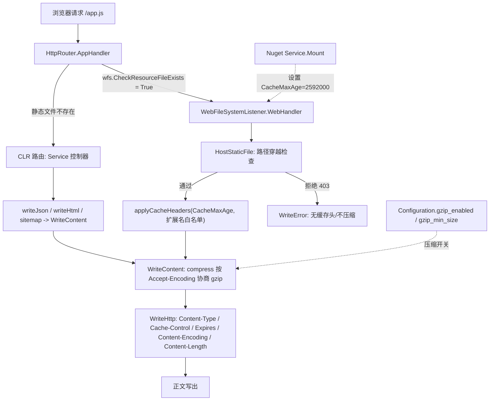

## 产品概述

为 xDoc 的 NuGet 包服务器（Fluteway 宿主 + Nuget.dll 控制器）补齐两项 HTTP 传输层能力：一是让 `dist\wwwroot` 下的静态资源在浏览器中缓存一个月，减少重复请求；二是让服务器对 HTTP 响应体做 gzip 压缩，降低带宽与首屏时间。

## 核心功能

1. 静态资源浏览器缓存：`dist\wwwroot` 下所有静态文件（js / css / png / xsl / html 等）响应时附加 `Cache-Control: public, max-age=2592000`（30 天）与配套的 `Expires`（GMT 到期时间），一个月内浏览器直接使用本地缓存，不再重复请求。
2. 缓存策略可配置：底层静态文件监听器提供「max-age + 可选扩展名白名单」能力（默认关闭，最大程度向后兼容），由 Nuget 应用在控制器挂载时设置为 30 天、且不设白名单（即全部静态文件生效）。
3. 响应体 gzip 压缩：客户端请求头携带 `Accept-Encoding: gzip` 时，对可压缩类型（text/*、json、xml、javascript、svg 等）且超过最小体积阈值的响应体做 gzip 压缩，并输出 `Content-Encoding: gzip` 与 `Vary: Accept-Encoding`，`Content-Length` 使用压缩后的真实长度。
4. 压缩覆盖范围：静态文件（小文件）、JSON 接口（`/api/*`、`/v3/*`）、服务端渲染的 HTML 文档页、sitemap.xml；已压缩的二进制（png/jpg/字体/nupkg）与大文件流式下载不压缩；403/404 错误响应不压缩、不缓存。

## 技术栈

- 语言/框架：Visual Basic .NET，net10.0，SDK 风格 vbproj
- HTTP 服务：`Flute.Http.Core`（`HttpSocket` / `HttpProcessor` / `HttpRouter` / `HttpResponse`），静态文件由 `Flute.FileSystem.WebFileSystemListener` 提供，宿主为 `Fluteway.exe /run`（`dist\run.cmd`）
- 压缩：`System.IO.Compression.GZipStream`（BCL，net10.0 内置）
- 落地项目：`G:\GCModeller\src\runtime\httpd\src\Flute`（库，提供能力，xDoc 工作区外但同属 `xGet.slnx`）+ `g:\xDoc\src\Nuget`（应用，设置策略与调用方式）

## 实现方案

**总策略：能力下推到库、策略上收到应用。**
Flute 只新增「可配置静态缓存策略」与「gzip 压缩能力」，默认行为对既有调用方不产生破坏（缓存默认关闭；gzip 仅在客户端声明 `Accept-Encoding: gzip` 时生效）；30 天缓存与「改用压缩感知写出接口」由 Nuget 应用决定。这样 Flute 保持通用，Nuget 站点立刻获得缓存与压缩，后续其它站点或维度调整无需再改库。

**关键改动点（均已核实源码）**

1. `WebFileSystem.HostStaticFile` 是写静态文件响应头的唯一出口，目前只设置了 `AccessControlAllowOrigin`，无缓存头、无编码头。
2. `HttpRouter.AppHandler` 先查静态文件再走 CLR 路由，Nuget 模块无法拦截静态响应，故缓存与压缩必须在 Flute 侧注入。
3. `HttpResponse.WriteHttp` 在输出头块末尾才遍历 `m_customHeaders`，因此 `Cache-Control`/`Expires`/`Content-Encoding` 必须在 `WriteHttp` 之前通过 `AddCustomHttpHeader` 写入。
4. `Content.WriteHeader` 仅在 `length > 0` 时写 `Content-Length`；gzip 后必须使用压缩后的长度构造 `Content`，否则客户端解压失败。
5. Fluteway `/run` 中 `router.MountFs(wfs)` 早于控制器 `Mount`，故 Nuget `Service.Mount` 内 `router.FileSystem` 必然就绪（仍沿用 `registerStaticFiles` 的判空风格）。
6. `WriteHTML` 支持多次追加调用，body 非一次性已知，**不做**整体压缩；改为在 Nuget 的 `writeHtml` 中改用一次性写出接口。

## 实现细节（执行要点）

**A. 静态缓存（Flute `FileSystem/WebFileSystem.vb`）**

- 新增 `Public Property CacheMaxAge As Integer`（秒；`<=0` 不下发缓存头，默认 0）与 `Public Property CacheExtensions As HashSet(Of String)`（`StringComparer.OrdinalIgnoreCase`，元素含前导点如 `.js`；为空/Nothing 表示全部静态文件生效）。
- 新增 `Private Shared Sub applyCacheHeaders(path, response, maxAge, extensions)`：命中时 `AddCustomHttpHeader(ResponseHeaders.CacheControl, $"public, max-age={maxAge}")` 与 `AddCustomHttpHeader(ResponseHeaders.Expires, DateTime.UtcNow.AddSeconds(maxAge).ToString("R"))`。
- 私有 `HostStaticFile` 与公共 `Shared HostStaticFile` 增加 `Optional` 参数传递策略（不破坏既有签名/调用方）；`WebHandler` 实例方法传入 `Me.CacheMaxAge`、`Me.CacheExtensions`；注入位置紧邻 `response.AccessControlAllowOrigin = "*"`，403 路径穿越分支在 return 前不写。

**B. gzip 能力（Flute）**

- `Configuration/Configuration.vb` 新增（带 `<Description>`，与既有属性风格一致）：`Public Property gzip_enabled As Boolean = True`、`Public Property gzip_min_size As Integer = 1024`。
- `HttpMessage/HttpResponse.vb`（新增 `Imports System.IO.Compression`）新增：
- `Private Function acceptGZip() As Boolean`：`m_requestHeaders` 中 `Accept-Encoding` 含 `gzip` 且未被 `q=0` 拒绝（大小写不敏感）。
- `Private Function isCompressible(mime As String) As Boolean`：`text/*`、`*json*`、`*xml*`、`*javascript*`、`image/svg+xml`。
- `Private Function compress(data As Byte(), mime As String) As Byte()`：满足（开关 + 协商 + 类型 + 体积阈值）时 `GZipStream` 压缩；**仅当压缩后更小**才 `AddCustomHttpHeader(ResponseHeaders.ContentEncoding, "gzip")`、`AddCustomHttpHeader(ResponseHeaders.Vary, HttpHeaderName.AcceptEncoding)` 并返回压缩数据，否则原样返回。
- `Public Sub WriteContent(data As Byte(), mimeType As String)`：先 `compress`，再 `WriteHttp(New Content With {.length = body.Length, .type = mimeType})`，随后写 BaseStream + Flush。
- `WriteJSON(Of T)`、`Overrides Write(String)`（含 `WriteLine`）内部改走 `compress`。
- `WebFileSystem.HostStaticFile` 小文件分支（≤ `STREAM_THRESHOLD` = 1MB）由 `response.WriteHttp(content).SendData(res)` 改为 `response.WriteContent(res, mime.MIMEType)`；大文件（>1MB，主要是 nupkg）保持流式原样，避免整包读入内存。

**C. Nuget 应用侧（`src/Nuget/Service.vb`）**

- `Mount` 中 `registerStyleSheetMime()` 之后：`Private Const StaticCacheSeconds As Integer = 30 * 24 * 60 * 60`（2592000），判空 `router.FileSystem IsNot Nothing` 后赋值 `CacheMaxAge`，不设白名单，输出一行 `.info()` 日志。
- 四处 `WriteHeader + SendData` 改为 `res.WriteContent(bytes, mime)`：`writeRawJson`（json 接口）、`writeHtml`（api 文档页/`/docs`）、readme 端点、sitemap.xml。图标端点 `res.SendFile` 保持原样。

**D. 性能与影响面**

- 缓存头：两次字典写入 + 一次时间格式化，热路径开销可忽略。
- 压缩：一次性 `MemoryStream` + `GZipStream`，1KB 阈值过滤小响应，压缩后更小才启用；大文件与二进制不压缩，避免 CPU 与内存浪费。
- 向后兼容：`CacheMaxAge` 默认 0（不写缓存头），gzip 仅在客户端声明时生效；不改动 403/404 错误页、不改动 websocket/长轮询路径（其 `m_requestHeaders`/`settings` 可能为空，需判空）、不做无关重构。

## 架构与数据流



## 目录结构

```
G:\GCModeller\src\runtime\httpd\src\Flute\
├── Configuration/
│   └── Configuration.vb      # [MODIFY] 新增 gzip_enabled（默认 True）与 gzip_min_size（默认 1024）配置项，带 <Description>，与既有 ini 映射风格一致
├── FileSystem/
│   └── WebFileSystem.vb      # [MODIFY] 新增 CacheMaxAge / CacheExtensions 属性与 applyCacheHeaders；HostStaticFile 注入缓存头并把小文件分支改为 WriteContent（获得 gzip）；默认关闭缓存保持兼容
└── HttpMessage/
    └── HttpResponse.vb       # [MODIFY] 新增 Imports System.IO.Compression；新增 acceptGZip / isCompressible / compress / WriteContent；WriteJSON 与 Write(String) 走压缩路径；WriteHTML 保持原样（支持追加）

g:\xDoc\src\Nuget\
└── Service.vb                # [MODIFY] Mount 中设置 router.FileSystem.CacheMaxAge = 2592000（30 天）并输出 info 日志；writeRawJson / writeHtml / readme / sitemap.xml 四处改用 res.WriteContent
```

## 关键代码结构

```
' WebFileSystemListener（Flute）——静态资源缓存策略
''' <summary>静态资源下发给浏览器的 max-age（秒）；小于等于 0 表示不下发缓存头。</summary>
Public Property CacheMaxAge As Integer

''' <summary>可选的扩展名白名单（含前导点，如 ".js"）；为空时对所有静态文件生效。</summary>
Public Property CacheExtensions As HashSet(Of String)

' HttpResponse（Flute）——gzip 压缩能力
''' <summary>按 mime 与客户端 Accept-Encoding 协商，返回压缩后（或原始）响应体；命中压缩时写入 Content-Encoding 与 Vary 头。</summary>
Private Function compress(data As Byte(), mime As String) As Byte()

''' <summary>一次性写出完整响应体：先压缩协商，再用压缩后的真实长度写 Content-Length。</summary>
Public Sub WriteContent(data As Byte(), mimeType As String)
```

## Agent Extensions

### SubAgent

- **code-explorer**
- 用途：实施阶段跨仓库核对 `G:\GCModeller` 中 `WriteHTML` / `SendData` / `TransferBinary` 的其它调用方，确认改为 `WriteContent` 不会破坏追加写语义
- 预期结果：得到完整调用方清单，若存在多次追加写场景则保持原路径不压缩

### Skill

- **lsp-code-analysis**
- 用途：对 `WebFileSystemListener`、`HttpResponse` 的新增成员做定义/引用导航与影响面分析，确认 VB 语法（Optional 参数、HashSet 导入）编译无误
- 预期结果：新增成员引用关系清晰、无符号冲突，编译前即可发现签名不匹配问题