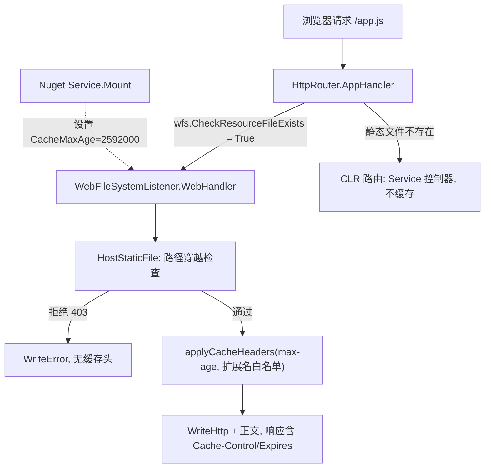

## 产品概述

为 xDoc 的 NuGet 包服务器（Fluteway 宿主 + Nuget.dll 控制器）托管的静态站点目录 `dist\wwwroot` 增加浏览器端缓存能力：服务器在响应静态资源时下发缓存响应头，浏览器在一个月内直接使用本地缓存，不再重复发起请求。

## 核心功能

- HTTP 服务器对 `dist\wwwroot` 下的静态文件（js / css / png / xsl / html 等全部静态文件）响应时附加缓存头：`Cache-Control: public, max-age=2592000`（30 天）与配套的 `Expires`（GMT 格式的到期时间）。
- 缓存策略做成服务器能力 + 应用配置两层：Flute 静态文件监听器提供可配置的 `max-age` 与可选的扩展名白名单（白名单为空表示全部静态文件生效，默认 0 表示不缓存，保证向后兼容）；Nuget 项目在控制器挂载时把该策略设置为 30 天。
- 缓存头只在正常返回静态文件（200）时写入，403 路径穿越拒绝与 404 不写；动态接口（`/api/*`、`/v3/*`、`/docs/*`、`/sitemap.xml` 等控制器路由）不受影响，保持实时。

## 技术栈

- 语言/框架：Visual Basic .NET，目标框架 net10.0（SDK 风格 vbproj）
- HTTP 服务：`Flute.Http.Core`（`HttpSocket` / `HttpRouter` / `HttpResponse`）静态文件服务由 `Flute.FileSystem.WebFileSystemListener` 提供；宿主为 `Fluteway.exe /run`（`dist\run.cmd`）
- 方案落地在两个项目：`G:\GCModeller\src\runtime\httpd\src\Flute`（库，提供能力）与 `g:\xDoc\src\Nuget`（应用，设置策略）

## 实现方案

**策略**：能力下推到库、策略上收到应用。Flute 只新增「可配置缓存策略」并负责在写出响应头前注入；具体的 30 天由 Nuget 应用决定。这样 Flute 保持通用与向后兼容（默认关闭），Nuget 站点立刻获得 30 天缓存，后续其它站点或扩展名维度调整也无需再改库。

**关键改动点（已核实）**：

1. `WebFileSystem.vb` 的 `HostStaticFile` 是唯一写静态文件响应头的地方，目前只设置了 `AccessControlAllowOrigin`，无任何缓存头。
2. `HttpRouter.AppHandler` 先查静态文件再走 CLR 路由，Nuget 模块无法拦截静态响应，因此必须在 Flute 侧注入。
3. `HttpResponse.WriteHttp` 在输出头块时才遍历 `m_customHeaders`，所以缓存头必须在 `WriteHttp` 之前通过 `AddCustomHttpHeader` 写入。
4. Fluteway `/run` 中 `router.MountFs(wfs)` 早于控制器 `Mount`，故 Nuget `Service.Mount` 内 `router.FileSystem` 必然就绪（仍需判空，参考 `registerStaticFiles` 的既有写法）。

## 实现细节（执行要点）

- 新增属性（带英文 XML 注释，与 Flute 现有风格一致）：
- `Public Property CacheMaxAge As Integer`：秒；`<=0` 不下发任何缓存头（默认 0，`--listen` 等其它调用方行为不变）。
- `Public Property CacheExtensions As HashSet(Of String)`（`StringComparer.OrdinalIgnoreCase`，元素含前导点如 `.js`）：为空/Nothing 表示所有静态文件生效；Nuget 侧保持为空（用户要求含 html 全部缓存）。
- 新增 `Private Shared Sub applyCacheHeaders(path, response, maxAge, extensions)`：命中时写入
`ResponseHeaders.CacheControl` = `$"public, max-age={maxAge}"`、`ResponseHeaders.Expires` = `DateTime.UtcNow.AddSeconds(maxAge).ToString("R")`。
头名常量取自 `Flute.Http.Core.Message.HttpHeader.ResponseHeaders`（`CacheControl` / `Expires`），避免硬编码字符串。
- 传参方式：私有 `HostStaticFile` 与公共 `Shared HostStaticFile` 增加 `Optional` 参数（不破坏既有签名与调用方），`WebHandler` 实例方法传入 `Me.CacheMaxAge` / `Me.CacheExtensions`；注入位置紧邻 `response.AccessControlAllowOrigin = "*"`（403 分支之前 return，不写）。
- Nuget 侧：`Service.vb` 中新增 `Private Const StaticCacheSeconds As Integer = 30 * 24 * 60 * 60`（2592000），在 `Mount` 中 `registerStyleSheetMime()` 之后判空 `router.FileSystem IsNot Nothing` 再赋值，并输出一行 info 日志（天数），与该文件既有 `.info()` / `.warning()` 日志风格一致。
- 性能：仅两次字典写入 + 一次 `DateTime` 格式化，热路径开销可忽略；无额外 IO。
- 兼容性与影响面：默认关闭，不改变 `--listen` 模式与其它调用方；不改动 404/错误页、不改动控制器响应、不改动 MIME 注册逻辑；不做无关重构。

## 架构与数据流



## 目录结构

```
G:\GCModeller\src\runtime\httpd\src\Flute\FileSystem\
└── WebFileSystem.vb   # [MODIFY] WebFileSystemListener 增加可配置缓存策略（CacheMaxAge / CacheExtensions）与 applyCacheHeaders；在 HostStaticFile 写响应头前注入 Cache-Control 与 Expires；默认关闭保持向后兼容

g:\xDoc\src\Nuget\
└── Service.vb         # [MODIFY] Mount 中在 registerStyleSheetMime() 后判空 router.FileSystem 并设置 30 天缓存（StaticCacheSeconds 常量 + info 日志）
```

## 关键代码结构

```
' WebFileSystemListener 新增（Flute）
''' <summary>静态资源下发给浏览器的 max-age（秒）；<=0 表示不下发缓存头。</summary>
Public Property CacheMaxAge As Integer

''' <summary>可选的扩展名白名单（含前导点，如 ".js"）；为空时对所有静态文件生效。</summary>
Public Property CacheExtensions As HashSet(Of String)

''' <summary>在 WriteHttp 之前写入缓存头；403/404 路径不调用。</summary>
Private Shared Sub applyCacheHeaders(path As String, response As HttpResponse,
                                     maxAge As Integer, extensions As ICollection(Of String))
```