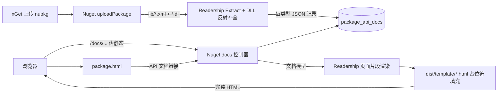

## 产品概述

在现有实验性 NuGet 程序包分发平台上，新增「随包 API 帮助文档」能力：上传的 nupkg 若内含 .NET XML 注释文档，服务端在发布时自动解析并入库；站点提供服务器端渲染、伪静态 URL 的 API 帮助文档页面，并可从程序包详情页跳转进入。

## 核心功能

1. **Readership 重构为两阶段**：将现有「一次性生成静态站点」拆分为「提取数据」与「针对特定页面的数据渲染」两步；`ApiDoc.Generate` 的既有静态站点生成行为保持不变。
2. **DLL 反射补全**：当 XML 注释缺失某类型成员信息时（典型如 enum 中未写注释的成员），通过反射解析同目录 dll 补全缺失成员，仅针对 public 访问的对象成员，补全后成员无注释文本。
3. **上传时提取文档**：上传 nupkg 时服务端解压包内 lib 文件夹的 XML 注释文档（连同同目录 dll 用于反射），经 Readership 提取后写入新的文档数据表，记录「包 id + 版本 + 类型 fullname + 类型的注释文档数据」。
4. **三个服务器端渲染的伪静态文档页面**：

- 文档主索引页面：跨包、全局合并所有已收录包的命名空间与类型，可直接跳转到任意类型页；
- 程序包帮助文档索引页面：单个包的命名空间/类型索引，可切换该包的版本；
- 文档内容模板页面：按包 id + 版本 + 类型 fullname 查询并渲染类型内容。

5. **模板可替换**：三个页面的 HTML 模板放在 `dist\template`，css/js/图片资源放在 `dist\wwwroot\assets`，由 NuGet 控制器读取模板进行服务端渲染，用户可随时替换模板。
6. **站点入口**：在 `dist\wwwroot\package.html` 增加跳转到该「程序包帮助文档索引页面」的链接。
7. **容错**：文档提取/反射补全失败仅记录警告，不影响程序包正常发布。

## 技术栈

- 语言与运行时：VB.NET / `net10.0`（沿用现有 `src/Readership`、`src/Nuget` 工程）。
- Readership：沿用 `Microsoft.VisualBasic.Core`（`ProjectSpace`/`ProjectType`/`ProjectMember`）、`markdown.NET5`；新增 `System.Reflection` 做 dll 元数据扫描。
- Nuget：沿用 Fluteway/Flute 控制器（`IHttpAppModule` + `<HttpGet>` 特性路由）、JSql 数据引擎、`System.Text.Json`；新增对 `Readership.vbproj` 的 `ProjectReference`。
- 前端：沿用 `dist/wwwroot` 暗色 `scibasic.css`，新增 `assets/css/docs.css`、`assets/js/docs.js`，模板为纯 HTML + `{{占位符}}`。

## 实现方案

### 1. Readership：提取 / 渲染两阶段

- **提取（Extract）**：新增可序列化文档模型 `ApiDocDocument`（命名空间/类型/成员/参数的 POCO，含全部注释文本）与 `ApiDoc.Extract(options) As ApiDocExtractResult`。流程：解析输入（单个 xml / 目录 / dll）→ `ProjectSpace.ImportFromXmlDocFile` 导入 → 反射补全 → 构建 `ApiDocDocument`（site slug/url、cref 索引、签名参数类型解析等现有逻辑迁移到文档构建器）。提取结果完全脱离 Core 的 `ProjectType`/`ProjectMember` 实时对象，可 JSON 序列化入库。
- **反射补全**：新增 `DocReflection.Supplement(doc, assemblyPath, warnings)`。对每个 xml 查找同目录同名 dll，`Assembly.LoadFrom` 加载（捕获 `ReflectionTypeLoadException` 取部分类型，缓存按路径），仅枚举 **public** 类型/public 成员；对文档中已存在但缺成员的公开类型，补入缺失的字段（含 enum 成员）、属性、方法、事件，注释文本留空。无法加载或类型不匹配时仅追加 warning。
- **渲染（Render）**：新增 `ApiDocRenderer`，按页生成 `DocPageModel`（标题、`ContentHtml` 内容片段、`SidebarHtml` 侧栏片段、面包屑、各类计数、版本选择）。新增 `DocTemplate.Render(template, values)` 做 `{{key}}` 占位符填充（未知键置空）。`ApiDoc.Generate` 保持为「Extract + 内置页面骨架逐页渲染 + 落盘」，静态站点输出与既有页面结构/视觉保持一致。
- 主题：`ThemeAssets` 保留 `Resolve`（发布到 `assets/css/scibasic.css`、`assets/css/docs.css`、`assets/js/docs.js`、`favicon.png`），Nuget 端直接复制到 `dist/wwwroot/assets`。

### 2. Nuget：存储与提取

- **数据表**（新增，沿用 JSql 建表与 `esc`/`nextId`/`SyncLock` 约定）：
`package_api_docs(id, package_id, version, namespace, namespace_summary, type_fullname, type_name, summary, payload)`；`payload` 为该类型的完整 JSON 文档数据（`LONGTEXT`）。
- **NupkgReader 扩展**：新增列出/批量抽取 zip 条目的能力，用于将包内 `lib/**` 下的 `*.xml` 与同名 `*.dll` 抽取到临时目录；按 TFM 优先选择（优先 `net*`/较高的 `netstandard*`）后交给 `ApiDoc.Extract`。
- **新增 `PackageApiDocs`（Nuget 侧编排）**：`Extract(nupkgPath)` → 每类型序列化为 `PackageApiDocRecord` 列表；`ApiDocPages` 负责从 DB 记录重建 `ApiDocDocument` 并渲染三类页面。
- **上传钩子**：在 `uploadPackage` 现有 `AddPackage`/`registerStaticFiles`/`indexPackage`/`refreshStatistics` 之后，best-effort 调用文档提取并 `ReplacePackageApiDocs(id, version, ...)`；任何异常只写 warning 日志，不影响发布成功返回。

### 3. Nuget：服务端渲染与伪静态路由

- 新增控制器路由（占位符按 Fluteway 规则为 `[^/]+` 且自动 URL 解码，支持 `{x}.html` 后缀）：
- `GET /docs/index.html`（及 `/docs`）→ 全局文档主索引；
- `GET /docs/{id}/{version}/index.html` → 程序包帮助文档索引（含版本切换）；
- `GET /docs/{id}/{version}/{type}.html` → 类型内容页（`type` 为 URL 编码的类型 fullname，路由值解码后按包 id+版本+fullname 查询）。
- 渲染：读取 `NugetConfiguration.TemplateDirectory`（配置键 `template`，默认 `./template`）下的 `docs-index.html`/`docs-package.html`/`docs-type.html`，用 `ApiDocPages` + `DocTemplate` 填充后以 `text/html; charset=utf-8` 经 `res.WriteHeader`+`res.SendData` 返回；模板缺失时回退内置最小模板并记录警告。资源（`assets/...`）由 wwwroot 静态文件系统直接服务。
- `package.html` 入口：在 `/api/package/{id}` 与 `/api/package/{id}/{version}` 响应中新增 `docs` 字段（`available`、`url`、`version`、`typeCount`），由 `app.js` 渲染「API 文档」链接。

### 4. 性能与可靠性

- 索引页仅使用标量列（namespace/type_name/summary/package_id/version），不解码 payload；类型页/包索引页只查询对应 `package_id + version` 的记录，避免全表大字段解码。整体为 O(该包类型数)，符合 JSql 小数据量定位。
- JSON 单行输出（`System.Text.Json` 默认）以适配 JSql `esc` 对换行的压平；`\`/`' `的转义沿用现有 `nuspec` 入库-读取往返做法，需在测试中验证往返一致。
- 提取仅做元数据读取，不执行业务代码；异常全部收敛为 warning。

## 实现要点

- **不要**在 `dist/wwwroot` 下创建与 `/docs/...` 路由同名的真实 `.html` 文件：Fluteway 的静态文件监听优先于控制器路由，会遮蔽服务端渲染。
- 复用现有约定：控制器特性路由与 `writeJson`/`res.WriteHeader`+`SendData`、`NugetStore` 的 `esc`/`nextId`/`SyncLock`、`NupkgReader` 的 zip 读取方式。
- 保持兼容：`ApiDoc.Generate` 签名与静态站点输出不变；`test apidoc` 继续可用；既有 REST/v3 端点只增不改。
- 反射补全严格限定 public，避免补入 internal/private 成员造成与 XML 文档语义不一致。

## 架构设计



## 目录结构

### Readership（`src/Readership`）

```
ApiDocOptions.vb            # [MODIFY] 增加 ReflectSupplement 等选项（可选）
ApiDocGenerator.vb          # [MODIFY] 拆为 Extract()（提取）+ Generate()（提取后逐页渲染落盘，保持兼容）
ApiDocDocument.vb           # [NEW] 可序列化文档模型：ApiDocDocument/ApiDocNamespace/ApiDocType/ApiDocMember/ApiDocParam
ApiDocExtract.vb            # [NEW] 提取阶段：输入解析、文档模型构建、url/slug/cref 索引
DocReflection.vb            # [NEW] dll 反射补全（仅 public，含 enum 成员），失败仅告警
ApiDocRenderer.vb           # [NEW] 生成 DocPageModel（内容片段 + 侧栏 + 面包屑 + 计数 + 版本选择）
DocTemplate.vb              # [NEW] {{占位符}} 模板渲染器（未知键置空）
ApiDocSite.vb               # [MODIFY] 保留 slug/url/参数解析等公共工具，供文档构建与渲染复用
CommentMarkdown.vb          # [MODIFY] cref 解析改为面向文档模型
Html/HtmlPage.vb            # [MODIFY] DocSiteContext 改为承载文档模型；拆出片段与内置页面骨架
Html/IndexPageWriter.vb     # [MODIFY] 改为渲染文档模型的索引内容
Html/NamespacePageWriter.vb # [MODIFY] 同上
Html/TypePageWriter.vb      # [MODIFY] 同上
Themes/ThemeAssets.vb       # [MODIFY] 保留/补充主题资源发布入口，供 wwwroot 资源同步
```

### Nuget（`src/Nuget`）

```
Nuget.vbproj            # [MODIFY] 增加 Readership.vbproj 的 ProjectReference
NugetConfiguration.vb   # [MODIFY] 新增 template 配置键与 TemplateDirectory（默认 ./template）
NupkgReader.vb          # [MODIFY] 新增列出/批量抽取 zip 条目（用于 lib 下 xml/dll）
NugetStore.vb           # [MODIFY] 新增 package_api_docs 表与增删查方法（Replace/Read/Has/Delete）
PackageApiDocs.vb       # [NEW] 上传时从 nupkg 提取文档并生成 PackageApiDocRecord
ApiDocPages.vb          # [NEW] 从 DB 记录重建文档模型，读取 dist/template 模板并服务端渲染三类页面
Service.vb              # [MODIFY] 上传钩子提取文档；新增 /docs 路由；/api/package 响应增加 docs 字段
```

### 站点与模板（`dist`）

```
template/docs-index.html        # [NEW] 文档主索引模板（全局命名空间/类型索引）
template/docs-package.html      # [NEW] 程序包帮助文档索引模板（含版本切换）
template/docs-type.html         # [NEW] 文档内容模板页面（类型页）
wwwroot/assets/css/docs.css     # [NEW] 文档布局样式（自 Readership 主题同步）
wwwroot/assets/js/docs.js       # [NEW] 侧栏筛选/折叠、锚点跳转等交互
wwwroot/package.html            # [MODIFY] 增加「API 文档」跳转链接元素
wwwroot/assets/js/app.js        # [MODIFY] 根据 /api/package 的 docs 字段渲染跳转链接
```

### 测试与文档

```
test/ApiDocTest.vb   # [MODIFY] 覆盖 Extract/反射补全，验证 Generate 输出不变
README.md            # [MODIFY] 更新第 11 节与新增的文档路由/表/模板说明
```

## 关键结构

`package_api_docs` 表（JSql，沿用现有建表风格）：

```sql
CREATE TABLE IF NOT EXISTS package_api_docs (
  id INT NOT NULL PRIMARY KEY,
  package_id VARCHAR(200) NOT NULL,
  version VARCHAR(100) NOT NULL,
  namespace VARCHAR(300),
  namespace_summary VARCHAR(2000),
  type_fullname VARCHAR(400) NOT NULL,
  type_name VARCHAR(200),
  summary VARCHAR(2000),
  payload LONGTEXT
) COMMENT='per package version api comment documents'
```

模板占位符契约（三份模板共用，`{{key}}` 替换）：

```
{{base}} {{site_title}} {{title}} {{subtitle}} {{description}}
{{content}} {{sidebar}} {{breadcrumb}}
{{namespace_count}} {{type_count}} {{member_count}}
{{package_id}} {{version}} {{version_select}} {{generated}} {{year}}
```

## Agent Extensions

### SubAgent

- **code-explorer**
- Purpose: 在重构 Readership 前，定位 `ApiDoc.Generate`、`ApiDocSite`、`DocSiteContext`、`CommentMarkdown` 及主题资源在全仓库的调用点与影响面，避免遗漏调用方。
- Expected outcome: 输出一份精确的调用点/引用清单，作为重构边界与回归验证依据。

### Skill

- **playwright-cli**
- Purpose: 在实现完成后，打开服务器实际渲染的 `/docs/index.html`、`/docs/{id}/{version}/index.html`、`/docs/{id}/{version}/{type}.html` 以及 `package.html` 的 API 文档跳转，验证伪静态页面可用、链接可达、版本切换与样式正常。
- Expected outcome: 得到可核验的页面截图与导航结果，确认服务端渲染与跳转链路端到端可用。