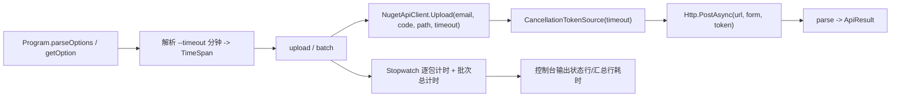

## 产品概述

为 `xGet` 这个实验性 NuGet 客户端（`src/xGet/xGet.vbproj`）增强上传命令的可用性：新增可配置的上传超时参数，并在批量上传时输出每个程序包的耗时，方便用户观察上传性能、定位慢包。

## 核心功能

- **新增 `--timeout`（别名 `-t`）参数**：以「分钟」为单位设置单次上传的超时时间，允许小数（如 `0.5`）。
- 作用于 `upload` 和 `batch` 两个命令，语义一致。
- 默认值 15 分钟。
- 非法值（非数字、小于等于 0）需给出明确错误提示并终止。
- **批量上传耗时报告**：
- 每个程序包处理完成后，在状态行末尾追加本次上传耗时，例如 `[2/10] ok      Foo.1.0.nupkg (12.34s)`。
- `ok` / `skip` / `failed` / `FAILED` 各类状态行均展示耗时。
- batch 结束时，在汇总行追加整个批次的总耗时，例如 `batch upload finished: 8 uploaded, 1 skipped, 1 failed (total 10) in 1m23.45s`。
- **超时行为**：超时后该请求被取消，按失败处理并输出可读信息（如提示已超过设定的超时时间），不影响批次中后续程序包的继续上传（认证类错误仍保持原有的中止逻辑）。
- **帮助信息更新**：`usage` 与 `options` 中补充 `--timeout` 说明。

## 视觉/交互效果（CLI 输出）

保持现有控制台输出风格不变，仅在原有状态行与汇总行上增量附加耗时信息，输出整洁、对齐一致。

## 技术栈

- 语言/平台：VB.NET，`TargetFramework=net10.0`（`OutputType=Exe`）。
- HTTP：沿用现有 `System.Net.Http.HttpClient`（共享静态实例）。
- 计时：`System.Diagnostics.Stopwatch`。
- 超时控制：`System.Threading.CancellationTokenSource` + `Timeout.InfiniteTimeSpan`。
- 仅修改现有文件，不新增文件、不引入新依赖。

## 实现方案

### 问题根因

当前 `NugetApiClient` 使用共享静态 `HttpClient`，其 `Timeout` 为默认 100 秒，且 `PostAsync` 调用未传 `CancellationToken`，因此无法为单次请求配置超时。仅在 `PostAsync` 处「设置超时」不可行，需要显式引入取消令牌。

### 关键决策

1. **共享 `Http.Timeout` 设为 `Timeout.InfiniteTimeSpan`**：因为 `HttpClient.Timeout` 与传入的 `CancellationToken` 取「较早触发者」，若不放开该属性，则 `--timeout 15` 仍会被默认 100 秒截断，配置将失效。改由每次请求的 `CancellationTokenSource` 独立控制超时。

- 该修改会移除 `register` 原先隐含的 100 秒保护，故为 `Register`/`Upload` 都提供统一的默认超时兜底（`DefaultTimeout`），避免无限等待。

2. **超时按「每次请求」而非「整个批次」**：`--timeout` 语义为单个程序包的上传超时，超时的包记为失败但批次继续（认证错误除外），与既有批量策略一致。
3. **`Upload`/`Register` 新增可选参数 `Optional timeout As TimeSpan? = Nothing`**：`Nothing` 时取类内 `DefaultTimeout`。`upload`/`batch` 由 CLI 解析出的分钟值传入，保持向后兼容（现有调用点均可无参调用）。
4. **耗时报告用 `Stopwatch`**：每个包一个计时（追加到状态行），批次循环外再套一个计时得到总耗时；输出使用统一的格式化辅助函数，保证 `秒` 与 `分+秒` 两种量级都可读。

### 性能与可靠性

- 计时为常数级开销，对上传耗时占比可忽略。
- 批量路径无额外文件遍历，`files` 仍复用既有的「按文件大小排序」逻辑。
- 超时取消通过 `CancellationTokenSource` 传播到 `PostAsync`，及时释放底层网络资源；`CancellationTokenSource` 使用 `Using` 确保释放，避免句柄泄漏。
- 异常处理：捕获 `OperationCanceledException`（含 `TaskCanceledException`），转换为 `ApiResult(ok=False, message="timed out after ...")`，与现有 `parse` 返回结构一致，不改变上层判定流程。

### 兼容性与影响面

- 仅影响 `src/xGet/NugetApiClient.vb`、`src/xGet/Program.vb` 两个文件。
- 不改变既有命令、选项别名与退出码语义；新增参数均为可选，旧命令行调用方式仍然有效。
- `register` 行为从「100 秒隐式超时」变为「`DefaultTimeout` 兜底」，为可控的等价替代。

## 架构设计

沿用现有分层（CLI 解析层 `Program` → HTTP 客户端层 `NugetApiClient`），不新增架构模式。数据流如下：



## 目录结构

本方案为在现有项目中增量修改，涉及文件如下：

```
xDoc/
└── src/
    └── xGet/
        ├── NugetApiClient.vb   # [MODIFY] 引入可配置超时能力
        │                       #   - Imports System.Threading
        │                       #   - Http.Timeout 设为 Timeout.InfiniteTimeSpan
        │                       #   - 新增 Shared ReadOnly DefaultTimeout As TimeSpan
        │                       #   - Register/Upload 增加 Optional timeout As TimeSpan? = Nothing
        │                       #   - 用 CancellationTokenSource(timeout) 调用 PostAsync(..., token)
        │                       #   - 捕获 OperationCanceledException，返回 ok=False 且 message 说明超时
        └── Program.vb          # [MODIFY] CLI 解析与耗时报告
                                #   - UsageText 增补 --timeout/-t 说明
                                #   - 新增 getTimeoutMinutes()（默认 15，校验正数，支持小数）
                                #   - upload() 解析并传递超时
                                #   - batch() 解析并传递超时；逐包 Stopwatch + 批次总 Stopwatch
                                #   - 新增 formatElapsed() 辅助函数，统一耗时格式
```

## 关键代码结构

超时参数化与取消处理的接口契约（示意，非最终实现）：

```
' NugetApiClient.vb
Private Shared ReadOnly Http As New HttpClient() With {
    .Timeout = Timeout.InfiniteTimeSpan   ' 放开默认 100 秒限制，改由取消令牌控制
}

' 默认超时兜底（register 及未显式传入超时的调用使用）
Private Shared ReadOnly DefaultTimeout As TimeSpan = TimeSpan.FromMinutes(15)

Public Function Upload(email As String, code As String, nupkgPath As String,
                       Optional timeout As TimeSpan? = Nothing) As ApiResult

Public Function Register(email As String,
                         Optional timeout As TimeSpan? = Nothing) As ApiResult
```

```
' Program.vb - CLI 超时解析（分钟，默认 15，非法值报错）
Private Function getTimeoutMinutes(options As Dictionary(Of String, String)) As Double
    ' 读取 "timeout"/"t"，空则返回 15
    ' Double.TryParse(..., NumberStyles.Float, CultureInfo.InvariantCulture)
    ' 解析失败或 <= 0 时由调用方打印错误并返回退出码 1
End Function
```

## 实现注意事项

- 保持现有代码风格：字符串插值、`Call Console.WriteLine`、缩进与注释风格一致；注释沿用英文风格。
- `parseOptions` 的取值规则要求选项值不以 `-` 开头，`--timeout 15`/`--timeout=15` 两种写法均需可用（`0.5` 等小数正常）。
- 耗时数值统一保留 2 位小数；小于 60 秒显示为 `X.XXs`，达到或超过 60 秒显示为 `XmY.YYs`，避免出现 `124.53s` 这类难读数值。
- 超时提示信息中应体现实际生效的时长（分钟或秒），便于用户确认参数是否生效。
- 仅为「超时/网络取消」输出失败信息，认证类错误（含 `TOTP`/`invalid email`）保持原有「打印并中止 batch（返回 3）」逻辑不变。
- 不修改 `src/Nuget/TotpModule.vb` 及 TOTP 逐包重算逻辑。