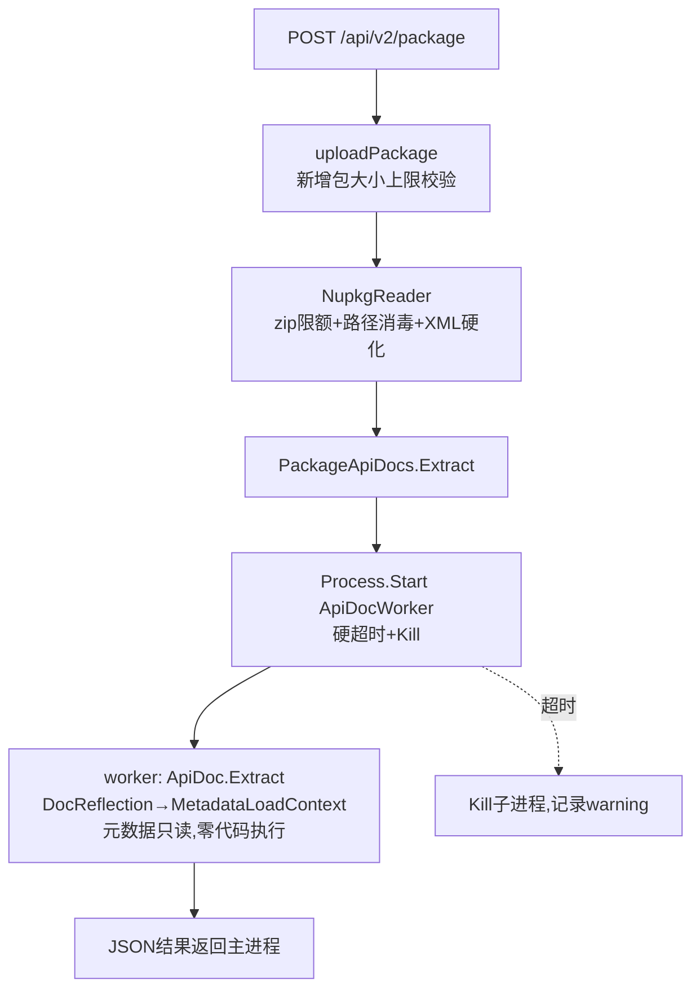

## 产品概述

对 xDoc NuGet 服务器进行四项改进：安全加固、包详情页上传者信息展示、注册开关、以及 xConsole 命令行管理工具。

## 核心功能

### 1. 安全加固（已确认方案：独立 worker 进程 + MetadataLoadContext）

- 用 `MetadataLoadContext`（元数据只读、绝不执行任何代码）替换 `DocReflection.vb` 中的 `AssemblyLoadContext.LoadFromStream` + `GetTypes()` 反射逻辑，消除包内 DLL 通过模块初始化器/特性构造器实现 RCE 的风险
- 新建独立控制台项目 ApiDocWorker，Nuget 服务以子进程方式调用它执行 API 文档提取，实现进程级隔离 + 硬超时强杀，恶意代码即使存在也无法影响服务器进程
- `NupkgReader.vb` 增加 zip 限额（条目数、单文件大小、解压总量、压缩比，按实际流式字节计数而非信任 `entry.Length`）；icon/readme 提取路径消毒（文件名白名单化 + 目标路径必须位于目标目录内）；nuspec 与 XML 注释文档解析强制 `DtdProcessing.Prohibit + XmlResolver = Nothing`
- 上传接口增加包文件大小上限（可配置）

### 2. 包详情页上传者信息（已确认：完整显示 email，xConsole 手动标记 official）

- `users` 表新增 `official` 布尔列，默认全部为非 official
- `packages` 表新增 `uploader` 列，上传时记录上传者 email（历史包显示为空/—）
- `dist/wwwroot/package.html` 详情页 facts 区显示 Uploader 行（完整 email）+ official badge 标记

### 3. 注册开关

- 新增配置键 `registration-enabled`（默认开启），关闭时 `/api/register` 返回 403 拒绝注册

### 4. xConsole 命令行工具（已确认功能范围）

- 浏览数据库数据表内容（列出表、分页查看行）
- 账号管理：列出用户（email/创建时间/是否 official）、设置/取消 official、删除用户（保留其已上传的包）、重置用户 TOTP 密钥并输出新 otpauth 链接
- 手动触发数据库 WAL checkpoint 合并
- 手动触发程序包 UMAP 降维 + kmeans 聚类重建

## 技术栈

- 语言/运行时：VB.NET，net10.0（与现有项目一致）
- 元数据只读：`System.Reflection.MetadataLoadContext`（NuGet 包，worker 项目引用）
- 存储：复用 JSql `SqlEngine`（NugetStore 模式：手动 esc + SyncLock 串行化）
- 前端：原生 JS（沿用 app.js 的 `esc()` 转义模式）
- 进程通信：worker 以 JSON 文件为输入/输出协议，`Process.Start` + `WaitForExit(timeout)` + 超时 Kill

## 实现方案

### 架构（安全链路改造）



### 关键决策

1. **MetadataLoadContext 替代 ALC**：`DocReflection.Supplement` 保持签名不变，内部将 `AssemblyLoadContext.LoadFromStream` 替换为创建 `MetadataLoadContext`（`PathAssemblyResolver` 探测运行时目录 + 包内临时目录 dll），`GetTypes()`/成员枚举 API 完全兼容，改动集中在一个文件；同时注册 resolver 白名单避免依赖回落劫持
2. **独立 worker 进程**：ApiDocWorker 读取 `--input <tempDir> --output <result.json>` 参数，调用 `ApiDoc.Extract(ReflectSupplement=True)`，将 `ApiDocDocument` 序列化为 JSON 写出；主进程 `PackageApiDocs.Extract` 改为优先尝试子进程（`AppContext.BaseDirectory` 下查找 `ApiDocWorker.exe`/`ApiDocWorker.dll`），超时/缺失时回退为进程内 MLC 执行并记录 warning（保证可用性），超时阈值可配置（`apidoc-timeout-seconds`，默认 120）
3. **zip 限额**：`ExtractLibComments`/`ExtractIcon`/`ExtractEntry` 统一改用流式复制并累计实际字节（不信 `entry.Length`），超出 `max-entry-mb`/总限额/条目数即抛 `InvalidDataException` 中止
4. **路径消毒**：icon/readme 扩展名白名单（.png/.jpg/.jpeg/.gif/.svg/.ico/.md/.markdown/.txt），目标路径校验 `Path.GetFullPath` 前缀必须落在目标目录内
5. **表结构演进**：JSql 无 ALTER 兼容性保证，采用 `CREATE TABLE IF NOT EXISTS` 更新列定义 + `ALTER TABLE ADD COLUMN` 包 try/catch 的幂等迁移（旧库自动补列，新值默认 0/''）
6. **xConsole 复用**：直接引用 Nuget.vbproj，通过 `NugetConfiguration.FromConfig`（`--data` 键）构造配置，`PackageClusterAnalysis.RunIfChanged(store, config, forceK)` 触发聚类，`store.Checkpoint()`/`MergeAll(force:=True)` 触发 WAL 合并；`StorageOptions.MultiProcessAccess=True` 已支持与服务器并发访问

## 目录结构

```
g:/xDoc/
├── src/
│   ├── ApiDocWorker/                       # [NEW] 文档提取隔离子进程
│   │   ├── ApiDocWorker.vbproj             # net10.0 控制台, 引用 Readership + System.Reflection.MetadataLoadContext
│   │   └── Program.vb                      # 解析 --input/--output, 调用 ApiDoc.Extract, JSON 落盘, 异常即非零退出
│   ├── Readership/
│   │   └── DocReflection.vb                # [MODIFY] ALC→MetadataLoadContext, resolver 白名单
│   ├── Nuget/
│   │   ├── NupkgReader.vb                  # [MODIFY] zip 限额/流式计数/路径消毒/XML 安全读取
│   │   ├── PackageApiDocs.vb               # [MODIFY] 子进程调用+超时+回退
│   │   ├── NugetConfiguration.vb           # [MODIFY] registration-enabled / max-upload-mb / apidoc-timeout-seconds
│   │   ├── NugetStore.vb                   # [MODIFY] users.official/packages.uploader 列迁移+读写方法
│   │   ├── TotpAuth.vb                     # [MODIFY] CreateUser 带 official; 新增 ResetSecret 辅助
│   │   └── Service.vb                      # [MODIFY] 注册开关拦截/记录 uploader/详情JSON增字段/上传大小限制
│   └── xConsole/
│       └── Program.vb                      # [MODIFY] 完整 CLI: tables/user/db checkpoint/cluster
└── dist/wwwroot/
    ├── package.html                        # [MODIFY] facts 区新增 Uploader 行
    └── assets/js/app.js                    # [MODIFY] 渲染 uploader + official badge (esc 转义)
```

## 实施要点

- xConsole 命令规范：`xConsole tables [name] [--limit N]`、`xConsole user list|official <email> on|off|delete <email>|reset <email>`、`xConsole db checkpoint`、`xConsole cluster rebuild [--k N]`，均需 `--data <dir>` 定位数据库
- NugetStore 新增：`SetUserOfficial(email, flag)`、`DeleteUser(email)`、`UpdateUserSecret(email, salt, secret)`、`GetPackageUploader` 读取；`readUser/readPackage` 适配新列
- badge 样式：沿用现有 chip/badge 风格，official 用高亮色小徽章，非 official 不显示 badge（避免视觉噪音）
- 渲染 uploader 与 badge 时全程 `esc()`/`DocHtml.Attr` 转义，与现有 XSS 防护一致
- 日志遵循现有 `".info()"/".warning()"` 模式，不记录 TOTP secret 明文

## Agent Extensions

### SubAgent

- **code-explorer**
- Purpose: 在实施前精确探明 JSql 的 ALTER TABLE/DELETE 支持情况、TotpModule.BuildOtpAuthUri 签名、app.js facts 渲染函数与 package.html facts 区完整结构
- Expected outcome: 确认存储层 API 可行性与前端插入点，避免对 JSql 能力的错误假设