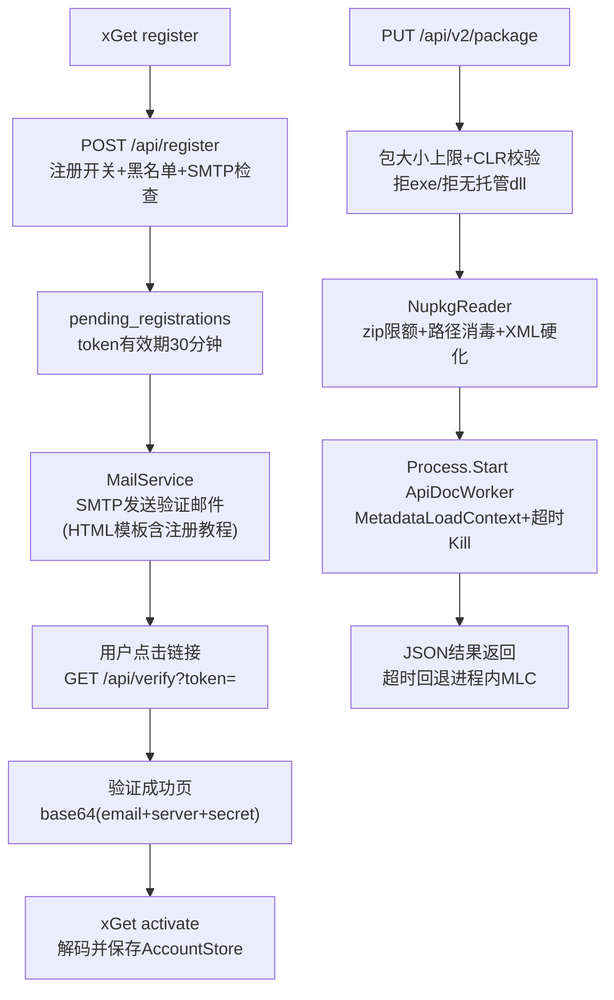

## 产品概述

对 xDoc NuGet 服务器进行安全加固与运营能力增强，共七项功能：服务器安全加固（元数据只读解析 + 独立子进程隔离 + zip/XML/路径硬化 + 包内容校验）、包详情页上传者信息与 official 徽章、注册开关、xConsole 运维命令行工具、邮箱域名黑名单、SMTP 邮件发送与邮箱验证注册流程。

## 核心功能

- **安全加固**：`DocReflection` 改用 `MetadataLoadContext`（只读元数据，零代码执行）；新建 ApiDocWorker 子进程执行文档提取，超时强杀；`NupkgReader` 增加解压限额（条目数/单文件/总量，流式字节计数）、icon/readme 路径消毒、XML 解析禁用 DTD；上传接口增加包大小上限。
- **包内容校验**：仅接受包含托管 .NET CLR dll 的 nupkg——lib 中存在任何 .exe 即拒绝；lib 中没有任何托管 CLR dll（PE 头 CLR 目录检测）即拒绝；被拒包不落盘、不入库。
- **上传者信息**：package 详情页完整显示上传者 email；`users` 表新增 `official` 列（默认全部非 official），official 用户在页面显示徽章。
- **注册开关**：新增 `registration-enabled` 配置键（默认开启），关闭时拒绝注册。
- **邮箱域名黑名单**：新建黑名单数据表，注册时拦截黑名单域名；xConsole 提供 list/add/remove。
- **邮件发送与邮箱验证**：SMTP 配置经 xConsole 配置并以加盐加密（AES-GCM + PBKDF2 + 密钥文件）写库；注册改为发送 30 分钟有效验证链接；验证成功页展示 base64 授权串（email + 服务器 url + totp 密钥）；xGet 新增 activate 命令解析并保存本地授权；SMTP 未配置时注册被拒且 xGet 提示用户提醒管理员。
- **xConsole 工具**：浏览数据表（分页）、用户管理（list/official/delete/reset）、黑名单管理、SMTP 配置（set/show/test）、手动 WAL checkpoint、手动触发 UAP 降维 + kmeans 聚类重建。

## 技术栈

- 语言/运行时：VB.NET，net10.0（与 Nuget/Readership/xGet/xConsole 一致）
- 元数据只读：`System.Reflection.MetadataLoadContext`（worker 项目 NuGet 引用）
- 存储：复用 JSql `SqlEngine`（手动 esc + SyncLock 串行化，`MultiProcessAccess=True` 支持与服务器并发）
- 邮件：`System.Net.Mail.SmtpClient`（BCL 内置，无新增外部依赖）
- 加密：`System.Security.Cryptography`（AesGcm + Rfc2898DeriveBytes(PBKDF2)）
- 前端：原生 JS，沿用 `app.js` 的 `esc()` 转义模式

## 架构设计



## 实现方案关键决策

1. **MetadataLoadContext 替代 ALC**：`DocReflection.Supplement` 签名不变，内部用 `PathAssemblyResolver`（运行时目录 + 包内临时目录 dll 白名单，阻断依赖回落劫持），`GetTypes()` 与成员枚举 API 兼容，改动集中在单文件。
2. **独立 worker 进程**：ApiDocWorker 接收 `--input <dir> --output <json>`，调用 `ApiDoc.Extract(ReflectSupplement=True)` 后序列化 JSON 落盘；主进程在 `AppContext.BaseDirectory` 查找 `ApiDocWorker.exe/.dll`，以 `Process.Start + WaitForExit(timeout) + Kill` 调用；超时/缺失回退为进程内 MLC 执行并记 warning。超时配置 `apidoc-timeout-seconds`（默认 120）。
3. **CLR 校验**：zip 内扫描 `lib/**/*.exe`（存在即拒）、`lib/**/*.dll` 至少一个通过 PE 头 CLR 数据目录（DataDirectory[14] 非零 + BSJB 元数据）检测为托管程序集；校验在读取 nuspec 之后、任何落盘之前执行。
4. **zip 限额**：`ExtractLibComments/ExtractIcon/ExtractEntry` 统一流式复制并累计实际字节（不信 `entry.Length`），超 `max-entry-mb`（默认 64）/总量（默认 512MB）/条目数（默认 2048）抛 `InvalidDataException`。
5. **路径消毒**：icon/readme 扩展名白名单（.png/.jpg/.jpeg/.gif/.svg/.ico/.md/.markdown/.txt），目标路径 `Path.GetFullPath` 前缀校验必须位于版本目录内。
6. **XML 硬化**：nuspec 与注释 XML 统一 `XmlReaderSettings{DtdProcessing.Prohibit, XmlResolver=Nothing, MaxCharactersFromEntities=0}`。
7. **表结构演进**：JSql 无 ALTER 保证 → `CREATE TABLE IF NOT EXISTS` 新列定义 + `ALTER TABLE ADD COLUMN` 包 try/catch 幂等迁移；新表 `pending_registrations`、`email_blacklist`、`server_settings`。
8. **验证注册流**：register 校验（开关→黑名单→SMTP 已配置）后生成 salt/secret 与 256bit hex token 写 `pending_registrations`（30 分钟过期，注册响应不再返回 secret）；verify 校验 token 有效后创建正式用户并删除 pending 记录；成功页展示 `base64(JSON{email, server, secret})`；xGet `activate --server --email --code` 解码校验匹配后 `AccountStore.Save`。
9. **SMTP 加盐加密**：数据目录自动生成 32 字节 `mail.key` + 每条配置 16 字节随机 salt，PBKDF2 派生密钥，AES-GCM 加密 JSON（host/port/user/pass/ssl/from），密文 `base64(salt|nonce|ciphertext)` 存 `server_settings`；xConsole `mail show` 掩码密码，`mail test` 发送测试邮件。
10. **xConsole 复用**：经 `NugetConfiguration.FromConfig`（`--data` 键）构造配置，`PackageClusterAnalysis.RunIfChanged(store, config, forceK)` 触发聚类，`store.Checkpoint()`/`MergeAll(force:=True)` 合并 WAL。

## 性能与可靠性

- zip 流式逐条处理，内存占用 O(单条目) 不随包大小增长；异常均捕获记录，不让单个恶意包拖垮服务。
- 反射提取从请求线程移出至带超时的子进程，阻塞上限为 `apidoc-timeout-seconds`。
- 日志沿用 `".info()"/".warning()"` 模式，不输出 TOTP secret 与 SMTP 密码明文。

## 目录结构

```
g:/xDoc/
├── src/
│   ├── ApiDocWorker/                       # [NEW] 文档提取隔离子进程
│   │   ├── ApiDocWorker.vbproj             # net10.0 控制台，引用 Readership + MetadataLoadContext
│   │   └── Program.vb                      # --input/--output，JSON 落盘，异常非零退出
│   ├── Readership/
│   │   └── DocReflection.vb                # [MODIFY] ALC→MetadataLoadContext + resolver 白名单
│   ├── Nuget/
│   │   ├── NupkgReader.vb                  # [MODIFY] zip 限额/流式计数/路径消毒/安全 XML 读取
│   │   ├── PackageValidator.vb             # [NEW] CLR 托管 dll 检测、exe 拒绝规则
│   │   ├── PackageApiDocs.vb               # [MODIFY] 子进程调用 + 超时 + 进程内回退
│   │   ├── MailService.vb                  # [NEW] SMTP 发送 + AES-GCM 加盐加密配置 + HTML 邮件模板渲染
│   │   ├── NugetConfiguration.vb           # [MODIFY] registration-enabled/max-upload-mb/apidoc-timeout-seconds 等
│   │   ├── NugetStore.vb                   # [MODIFY] 列迁移 + pending_registrations/email_blacklist/server_settings 表及读写
│   │   ├── TotpAuth.vb                     # [MODIFY] 验证注册流辅助（salt/secret 生成、ResetSecret）
│   │   ├── TotpModule.vb                   # [MODIFY] （如需）验证邮件模板所需的辅助函数
│   │   └── Service.vb                      # [MODIFY] 注册开关/黑名单/验证流程/verify 页/包校验拦截/uploader/详情 JSON
│   ├── xGet/
│   │   ├── Program.vb                      # [MODIFY] register 改为提示等待邮件；新增 activate 命令
│   │   └── NugetApiClient.vb               # [MODIFY] ApiResult 增加 mail 配置标志
│   └── xConsole/
│       └── Program.vb                      # [MODIFY] tables/user/blacklist/mail/db checkpoint/cluster 全量 CLI
├── template/
│   ├── verify-email.html                   # [NEW] 验证邮件 HTML 模板（含注册教程）
│   └── verify-success.html                 # [NEW] 验证成功页模板（展示 base64 授权串）
└── dist/wwwroot/
    ├── package.html                        # [MODIFY] facts 区新增 Uploader 行 + official badge 容器
    └── assets/js/app.js                    # [MODIFY] 渲染 uploader email 与 official badge（esc 转义）
```

## 设计说明

仅新增两处轻量服务端渲染页面（复用现有 `DocTemplate` 的 `{{placeholder}}` 模板机制与站点 CSS 变量），package.html 为小幅内容修改不涉及重设计：

- **验证邮件模板（verify-email.html）**：单列居中卡片布局，品牌头部 + 问候语 + 大按钮「验证我的邮箱」（含 30 分钟有效期提示）+ 「注册教程」分步说明（1. 等待邮件 → 2. 点击验证 → 3. 复制 base64 授权串 → 4. `xGet activate` 命令示例代码块）+ 页脚免责小字；内联 CSS（邮件客户端兼容），主色沿用站点主蓝。
- **验证成功页（verify-success.html）**：居中卡片，绿色成功图标 + 「邮箱验证成功」标题 + 说明文字 + 等宽字体代码块展示 base64 授权串（可全选复制，带复制按钮与成功反馈）+ `xGet activate` 用法示例；失败场景显示错误原因与重新注册引导。
- xConsole 为终端 CLI，无 UI 设计。

## Agent Extensions

### SubAgent

- **code-explorer**
- Purpose: 实施前确认 JSql 引擎对 DELETE/ALTER TABLE 语句的支持情况、`TotpModule` 完整公开签名（BuildOtpAuthUri/GenerateTotp/Base32Encode）、`template` 目录现有文件结构与模板占位符约定、xGet `AccountStore`/`NugetApiClient` 的完整 API 面
- Expected outcome: 产出一份实施约束清单，确保 xConsole 的 DELETE/黑名单写入、验证邮件模板占位符、xGet activate 命令均建立在真实可用的底层 API 上